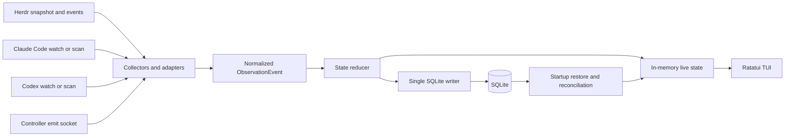

# Herdr Top MVP Design

## 1. Overview

Herdr Top is a Herdr-native terminal UI for observing Claude Code and Codex multi-agent execution in real time.

The tool runs inside a pane managed by the target Herdr session and observes that session's workspaces, tabs, panes, agent sessions, task runs, dependencies, and recent activity. It complements Herdr instead of replacing its session, terminal, workspace, or worktree management.

Repository: [mageyuki/herdr-top](https://github.com/mageyuki/herdr-top)

## 2. Decision summary

| Area | MVP decision |
| --- | --- |
| Product name | Herdr Top |
| Repository and binary | `herdr-top` |
| Runtime | A regular Herdr-managed pane or tab inside the target named session |
| Required platform | Herdr 0.8.0 or newer |
| Agent providers | Claude Code and Codex |
| Superpowers | Not required and not used as a required data source |
| Primary view | Fixed-screen, htop-style live TUI |
| Hierarchy | Herdr physical topology plus Task Run and native sub-agent nesting |
| Physical pane identity | Herdr `terminal_id` is stable identity; public `pane_id` is the current address |
| Cross-pane relationship | Independent and `unlinked` unless an explicit Controller event exists |
| Dependency representation | A DAG separate from the execution tree |
| Data acquisition | Herdr snapshot/events, including reported native sessions, plus non-invasive Claude/Codex local metadata observation |
| Provider fallback | Two-second rescan when file watching is unavailable; no terminal-output scraping |
| Task Run identity | Explicit `task_run_id`, then native session ID with Herdr-reported identity preferred, then provisional `terminal_id + start time` |
| Controller protocol | Versioned JSON over a session-scoped Unix domain socket through `herdr-top emit` |
| Persistence | Session-scoped SQLite as the source of truth |
| Retention | Finished Task Runs 30 days; events 7 days and at most 100,000 per session |
| Process model | One collector, reducer, SQLite writer, event socket, and TUI process per Herdr session |
| Second launch | Focus the existing Herdr Top pane instead of starting another collector |
| Quit | `q` stops Herdr Top only; Claude/Codex agents keep running |
| Restart behavior | Detach keeps the collector alive; cold server restart requires the next manual Herdr Top launch to restore and reconcile |
| Implementation language | Rust |
| Initial platforms | macOS arm64/x86_64 and Linux arm64/x86_64 |
| Distribution | Herdr managed GitHub plugin plus optional standalone CLI for Controller integration |
| License | MIT |

## 3. Goals

The MVP must:

- Run as a regular Herdr plugin pane or tab within the Herdr session being observed.
- Show current Claude Code and Codex activity across the same Herdr session.
- Make workspace, tab, pane, Task Run, and native sub-agent relationships understandable.
- Show cross-pane task relationships and dependencies only when explicitly recorded.
- Keep execution topology and task dependencies as separate views.
- Reflect watched Herdr or provider changes within one second under normal conditions and within about two seconds when using the scan fallback.
- Show observation scope, freshness, source coverage, and degraded states in the fixed header.
- Restore persisted semantic state on the next Herdr Top launch after a cold Herdr server restart.
- Keep the display stable while information updates continuously.
- Work without Superpowers.
- Remain local-first and avoid sending session contents to an external service.
- Continue providing Herdr-only visibility when Claude or Codex metadata cannot be read.

## 4. Non-goals

The MVP does not:

- Replace Herdr as a multiplexer, session manager, worktree manager, or process owner.
- Orchestrate agents by itself.
- Infer semantic relationships from shared directories, neighboring panes, timestamps, prompts, or similar heuristics.
- Split one native agent session into multiple Task Runs by inspecting prompts or idle gaps.
- Treat token usage, context-window usage, or visible activity as task completion percentage.
- Scrape terminal output as a provider integration.
- Automatically restart the collector after a cold Herdr server restart.
- Run the long-lived monitor in a Herdr popup.
- Provide an unlimited long-term analytics or audit-history product.
- Support providers other than Claude Code and Codex.
- Support Windows in the initial release.
- Require a hosted observability service.
- Run multiple simultaneous TUI clients or perform automatic collector leader election.
- Install a standalone CLI into `PATH` without explicit user action.

## 5. Management units and terminology

### 5.1 Herdr physical units

Herdr owns the physical runtime hierarchy.

```text
Herdr named session
└── Workspace
    └── Tab
        └── Pane
            └── Foreground agent process
```

| Unit | Meaning in Herdr Top |
| --- | --- |
| Herdr named session | Runtime and socket namespace for a persistent Herdr server. Herdr Top observes one session at a time. |
| Workspace | Top-level Herdr project container. A repository or investigation usually maps to a workspace. |
| Project | Not a separate formal Herdr entity. The UI uses the workspace for project-like grouping. |
| Tab | A layout within a workspace. |
| Pane | A real terminal and the physical execution location of an agent or command. |
| `terminal_id` | Stable physical terminal identity used to follow a pane across moves. |
| Public `pane_id` | The pane's current Herdr address. It may change when a terminal moves between workspaces. |
| Native agent session | Claude Code or Codex's resumable session identity, distinct from a Herdr named session. |

References: [Herdr concepts](https://herdr.dev/docs/concepts/), [Herdr integrations](https://herdr.dev/docs/integrations/).

### 5.2 Herdr Top semantic units

| Unit | Meaning |
| --- | --- |
| Task Run | Herdr Top's semantic unit for one observed task execution. A pane may host multiple Task Runs over time. |
| Agent Node | A Claude Code or Codex execution participating in a Task Run. |
| Native Sub-agent | A provider-native child session nested below its parent Task Run or Agent Node. |
| Execution Edge | An explicit parent-child relationship, such as a Controller dispatch. |
| Dependency Edge | An explicit directed relationship between Task Runs, such as `depends_on`. |
| Observation Event | A normalized event produced by a Herdr, Claude, Codex, or Controller adapter. |

A pane is an execution location, not a task identity.

### 5.3 Task Run identity and lifecycle

Identity is resolved in this order:

1. Explicit Controller `task_run_id`.
2. Provider plus native Claude Code or Codex session ID, preferring Herdr's official-integration `agent_session` when available and using provider-local metadata as fallback.
3. Provisional `terminal_id + observed start time`.

Rules:

- A different native session in the same pane creates a new Task Run.
- Resuming the same native session reactivates the existing Task Run.
- Moving the same terminal or native session does not create a new Task Run.
- A provisional Task Run merges into the resolved identity when the native session ID appears.
- Multiple prompts inside one native session are not automatically split.
- Finer semantic boundaries require explicit Controller events.
- Pane closure or process exit changes execution state, not semantic task completion.

## 6. Execution tree and task dependency DAG

The execution tree and the dependency graph answer different questions and must remain separate.

### 6.1 Execution tree

The execution tree answers: "Where is each execution running, and which native sub-agent belongs to it?"

```text
Session
├── Workspace: api
│   ├── Tab: implementation
│   │   ├── Pane w1:p1
│   │   │   └── Task Run: controller
│   │   │       ├── Claude sub-agent: investigate
│   │   │       └── Codex sub-agent: implement
│   │   └── Pane w1:p2
│   │       └── Task Run: tests [unlinked]
│   └── Tab: review
└── Workspace: docs
```

### 6.2 Task dependency DAG

The dependency view answers: "Which task must finish before another task can proceed?"

```text
investigate ──> implement ──> test ──> review
                    └───────> docs
```

Nesting must not be used to represent every dependency. A Task Run can depend on multiple other Task Runs, so dependencies form a DAG rather than a strict tree.

### 6.3 Unlinked rule

A task observed in another pane is displayed as an independent Task Run with `unlinked` relationship status unless an explicit event links it.

Herdr Top must not infer a Controller relationship from:

- the same workspace or tab;
- the same repository or current working directory;
- adjacent panes;
- similar start times;
- similar prompts or terminal output.

This rule favors an incomplete but truthful graph over a visually complete but incorrect graph.

## 7. Data sources

### 7.1 Herdr

Herdr is authoritative for:

- named-session connection;
- workspace, tab, and pane topology;
- `terminal_id` and current public `pane_id`;
- pane lifecycle and movement;
- detected agent kind and Herdr-reported execution state;
- official-integration `agent_session` identity for the pane's top-level native agent when available;
- active and focused pane metadata;
- plugin paths and invocation context.

The collector connects through `HERDR_SOCKET_PATH`, fetches an initial snapshot, and subscribes to events. Reconnect always triggers a fresh snapshot before subscription resumes.

A valid Herdr-reported `agent_session` is the preferred source for the top-level native session identity. Its absence does not prevent physical monitoring; the Claude or Codex adapter can resolve the identity from provider-local metadata. Conflicting identities are not merged by inference and are surfaced through diagnostics and source coverage.

References: [Herdr CLI reference](https://herdr.dev/docs/cli-reference/), [Herdr Socket API](https://herdr.dev/docs/socket-api/).

### 7.2 Claude Code and Codex adapters

Provider adapters use a non-invasive hybrid strategy:

1. Watch or tail locally available native session metadata.
2. Normalize provider, native session ID, model when available, recursive native sub-agent nesting, lifecycle signals, and redacted activity summaries.
3. Fall back to a two-second rescan when file notification is unavailable or unreliable.
4. Never scrape terminal output.

The common baseline is provider identity, native session identity, execution state, recent normalized activity, and native sub-agent nesting when exposed. Missing fields remain unavailable rather than fabricated.

Agent Nodes form a recursive tree rather than a fixed one-level list. A native parent-child edge is created only when provider metadata establishes it. If an agent is observable but its immediate parent is not, it remains directly under the Task Run without an inferred Agent Node parent.

Claude Code hooks or OpenTelemetry may be added as optional higher-fidelity inputs. Core monitoring must not require Claude settings mutation, an OTLP exporter, or beta telemetry. Claude-local task or lifecycle events never create cross-pane Controller execution or dependency edges by themselves.

Provider formats are unstable external formats. Adapters accept optional and unknown fields, isolate parsing failures, and expose source coverage. If an adapter cannot read its source, the TUI remains usable in `DEGRADED / Herdr-only` mode.

### 7.3 Explicit Controller events

A Controller or custom orchestrator can publish:

- `dispatch`;
- `task_started`;
- `depends_on`;
- `blocked`;
- `progress`;
- `complete`;
- `failed`;
- `cancelled`.

`dispatch` records an execution parent-child relationship. `depends_on` records a dependency DAG edge. Neither implies the other.

The collector owns a session-scoped Unix domain socket at `collector.sock` with current-user-only permissions. `herdr-top emit` sends one versioned JSON event and waits for `accepted`, `duplicate`, or `rejected`.

The minimum envelope contains:

- `schema_version = 1`;
- unique `event_id` and emission timestamp;
- source or Controller name and event type;
- Task Run ID;
- parent Task Run ID or dependency endpoints when applicable;
- optional label, progress, reason, provider, native session ID, and terminal identity.

The collector deduplicates by `event_id` and rejects dependency cycles. If the collector is unavailable, `emit` warns but exits successfully by default so monitoring cannot stop orchestration. `--strict` returns non-zero for callers that require enforcement.

Controller events are optional for read-only live monitoring but required for a complete cross-pane execution relationship or task DAG.

## 8. State model

Execution state, task state, relationship state, and observation quality are separate.

### 8.1 Execution state

- `unknown`
- `idle`
- `working`
- `blocked`
- `stale`
- `ended`

`stale` is temporary. An execution that disappears without an authoritative close remains stale for 30 seconds. If a fresh snapshot still cannot find it, execution becomes `ended`. Explicit pane close or process exit moves directly to `ended`. Reappearance of the same native session during the grace period restores its live state.

### 8.2 Task state

- `queued`
- `running`
- `blocked`
- `completed`
- `failed`
- `cancelled`

Activity, stale timeout, pane closure, and process exit do not mark a Task Run completed or infer a percentage. A Controller Task Run still marked `running` or `blocked` remains visible even with no live execution.

### 8.3 Relationship state

- `unlinked`: no explicit Controller or dependency relationship is known;
- `linked`: at least one explicit semantic relationship identifies the Task Run.

Execution parent-child edges and dependency edges are stored separately.

### 8.4 Observation quality

- `LIVE`: subscribed and within the freshness target;
- `RECONCILING`: restoring, reconnecting, or resnapshotting;
- `DISCONNECTED`: Herdr socket unavailable;
- `DEGRADED`: physical state available but a provider source or performance target is unavailable.

### 8.5 Minimum normalized event fields

Each normalized observation contains:

- event ID, timestamp, source, and source event type;
- Herdr session namespace;
- workspace, tab, public pane ID, and terminal ID when applicable;
- provider and native session ID when applicable;
- Task Run and Agent Node IDs when known;
- normalized execution or task-state change;
- optional execution-parent or dependency endpoints;
- source coverage and minimal provider metadata.

## 9. Architecture



### 9.1 Components

| Component | Responsibility |
| --- | --- |
| Herdr collector | Snapshot, event subscription, reconnect, and resnapshot. |
| Claude adapter | Watch or scan and normalize Claude session and sub-agent information. |
| Codex adapter | Watch or scan and normalize Codex session and sub-agent information. |
| Controller-event input | Validate and acknowledge semantic events over local IPC. |
| State reducer | Apply ordered events to execution and dependency models. |
| SQLite writer | Be the only component that mutates the database. |
| TUI | Render in-memory state and handle navigation. |
| Diagnostics | Report Herdr, lock, database, provider, version, and coverage health. |

### 9.2 Concurrency and rendering

Collectors send normalized events through bounded in-process channels. The reducer serializes transitions and sends persistence operations to one SQLite writer. The TUI renders in-memory state, not SQLite per frame. Rendering is event-driven and capped at 10 frames per second.

### 9.3 Session singleton

One owner process per Herdr named session owns the collector, reducer, writer, event socket, and TUI.

An OS advisory lock is scoped to a stable key derived from the Herdr session or socket namespace, never from launch cwd.

Startup:

1. Resolve the session key and attempt the advisory lock.
2. If acquired, remove only the stale Herdr Top socket, open the database, reconcile, and become owner.
3. If held, validate and focus the recorded owner pane, then exit without opening SQLite as writer.
4. If focus fails while the lock remains held, report owner information and do not start a second collector.

The OS releases the lock when the owner exits or crashes. A live but hung owner keeps it; the operator closes that pane before relaunching. Leases, fencing, leader election, and multiple clients are outside the MVP.

`q` stops Herdr Top's TUI, collector, socket, and writer only. It never stops Claude Code, Codex, or another pane. Direct CLI launch returns to its shell. Closing the owner pane has the same monitor-only effect. Herdr detach and reattach leave the process running.

## 10. Persistence and restart behavior

SQLite is the source of truth for recoverable Herdr Top state.

```text
$HERDR_PLUGIN_STATE_DIR/sessions/<session-key>/collector.lock
$HERDR_PLUGIN_STATE_DIR/sessions/<session-key>/collector.sock
$HERDR_PLUGIN_STATE_DIR/sessions/<session-key>/herdr-top.sqlite3
```

The path-safe `session-key` comes from the Herdr session or socket namespace. Different directories in the same default session share it; different named sessions do not.

Initial tables:

- `herdr_sessions`, `workspaces`, `tabs`, and `panes`;
- `native_agent_sessions`, `task_runs`, and `agent_nodes`;
- `execution_edges` and `dependency_edges`;
- `events` and `schema_migrations`.

SQLite runs in WAL mode through bundled `rusqlite`.

### 10.1 Startup reconciliation

After every successful owner launch:

1. Remove only the stale IPC socket inside the acquired session directory.
2. Back up the database before schema migration.
3. Open and migrate the database.
4. Load persisted Task Runs, Agent Nodes, edges, and recent events.
5. Connect to the current Herdr named session.
6. Fetch a fresh workspace, tab, pane, terminal, and agent snapshot.
7. Reconcile physical nodes by `terminal_id` and semantic nodes by the identity rules.
8. Mark non-authoritatively missing executions `stale` and apply the 30-second grace.
9. Subscribe to Herdr and provider changes and enter the TUI.

A second invocation does not reconcile because it does not acquire the lock.

### 10.2 Runtime lifecycle

- Detach and reattach: owner keeps running.
- Cold Herdr restart: arbitrary monitor processes end; Herdr Top is not auto-started.
- Next manual launch: load SQLite, fetch a fresh snapshot, and reconcile.
- Live Herdr handoff or socket replacement: enter `RECONCILING`, reconnect, resnapshot, resubscribe, and show an event-gap warning when continuity is unprovable.
- Provider source loss: retain Herdr topology in `DEGRADED / Herdr-only` mode.

Herdr restores its own topology and supported agent sessions. Herdr Top restores only its semantic model.

### 10.3 Retention and default visibility

- Active and non-terminal Task Runs are never time-hidden or auto-pruned.
- A `running` or `blocked` Task Run without live execution remains visible.
- Finished Task Runs and unreferenced edges are retained for 30 days.
- Events are retained for 7 days and at most 100,000 per named session.
- Parents or dependencies referenced by active Task Runs are not pruned.
- Cleanup runs at startup and periodically after ingestion.

The default TUI shows all non-terminal Task Runs plus runs that became `completed`, `failed`, `cancelled`, or unlinked `ended / outcome unknown` during the last hour. Older retained runs remain filterable.

Prompts, responses, terminal scrollback, and raw provider payloads are not retained.

## 11. TUI behavior

The alternate-screen interface is fixed rather than append-only.

```text
┌ Herdr Top ─ host / session / workspaces / LIVE / lag / sources ┐
│ filters and summary counters                                   │
├ Execution tree or dependency view ─────────────────────────────┤
│ stable, selectable, internally scrollable viewport             │
├ Activity for selected item ────────────────────────────────────┤
│ recent normalized events                                       │
├ q stop monitor  tab view  / filter  f follow  ? help ──────────┤
```

Required behavior:

- fixed header and footer;
- header shows host, named session, workspace count, quality, event lag, and source coverage;
- `LIVE`, `RECONCILING`, `DISCONNECTED`, and `DEGRADED` indicators;
- internal scrolling and lower selected-item activity;
- stable ordering and selection during updates;
- manual scroll disables follow; `f` or End resumes it;
- expand/collapse and filtering that retains matching ancestors;
- execution-tree and dependency-DAG toggle;
- distinct `unlinked`, `blocked`, `stale`, `ended`, and terminal task states;
- selection moves to a surviving ancestor or neighbor when its node closes, with the reason shown;
- `?` opens key help and setup guidance;
- minimum-size screen and safe truncation for narrow panes and wide Unicode;
- footer distinguishes `q` from Herdr detach.

Direct `herdr-top` uses the current pane and returns to its shell on `q`. The plugin entrypoint opens or focuses a dedicated regular tab or pane. It does not use a popup because popups have no Herdr pane identity.

On first TUI launch only, if a compatible standalone CLI is not discoverable in `PATH`, show a dismissible Controller-integration notice. Basic monitoring remains fully functional. `?` keeps the standalone CLI and `emit` setup instructions available.

## 12. Herdr plugin packaging

The repository includes `herdr-plugin.toml`.

```toml
id = "mageyuki.herdr-top"
name = "Herdr Top"
version = "0.1.0"
min_herdr_version = "0.8.0"
platforms = ["linux", "macos"]

[[panes]]
id = "top"
title = "Herdr Top"
placement = "tab"
command = ["bin/herdr-top"]
```

The long-running TUI is a pane command, not a startup hook.

### 12.1 Installation and update

General installation:

```sh
herdr plugin install mageyuki/herdr-top
```

Development:

```sh
cargo build --release
herdr plugin link /absolute/path/to/herdr-top
```

`plugin link` does not run build commands.

For update, press `q` while agents continue, then run:

```sh
herdr plugin install mageyuki/herdr-top --yes
```

Reinstallation replaces the managed checkout. Databases and settings remain in plugin state/config directories. Automatic update is deferred.

### 12.2 Release artifacts and Marketplace

Tagged releases provide checksum-verified binaries for macOS arm64/x86_64 and Linux arm64/x86_64. The plugin build command selects and verifies the matching artifact without requiring Rust.

After the first usable release, add the `herdr-plugin` GitHub topic for Marketplace discovery.

Herdr 0.8.0 has no supported post-install caveat field and does not show successful build output. The plugin does not write to `/dev/tty` or silently mutate `PATH`. Optional CLI setup is explained by the first-launch notice and `?`.

### 12.3 Optional standalone CLI and diagnostics

The managed plugin is sufficient for live monitoring. Controller-event users explicitly install the same release's standalone binary into `PATH`.

```sh
herdr-top --version
herdr-top emit ...
herdr-top doctor
herdr-top doctor --json
```

Herdr logs remain available through:

```sh
herdr plugin log list --plugin mageyuki.herdr-top
```

`doctor` checks Herdr socket, session key, lock, database schema, provider discovery, Herdr official-integration versions, plugin/CLI compatibility, native-session coverage, and log locations without printing prompts or responses. For Herdr 0.8.0 native session restore, it expects Claude Code integration version 6 or newer and Codex integration version 5 or newer. Missing or older integrations do not block Herdr-only monitoring, but diagnostics explain the unavailable `agent_session` and restore coverage.

## 13. Technology stack

| Purpose | Rust crate |
| --- | --- |
| TUI | `ratatui` |
| Terminal backend | `crossterm` |
| Async socket, file, and event work | `tokio` |
| SQLite | `rusqlite` with `bundled` |
| Serialization | `serde`, `serde_json` |
| CLI and emit subcommand | `clap` |
| Structured logs | `tracing`, `tracing-subscriber` |
| Error types | `thiserror` |
| Internal IDs | `ulid` |

Rust is selected for single-binary distribution, predictable long-running resource use, terminal control, strong event and state types, and compatibility with the Herdr/Rust ecosystem.

Provider adapters must not force unstable Claude Code or Codex JSON into an overly rigid domain model. Unknown fields remain tolerated at the adapter boundary.

## 14. Privacy, safety, and failure handling

- Observation, IPC, and storage remain local by default.
- Store normalized metadata, not prompts, responses, or terminal scrollback.
- Raw provider payload persistence is disabled.
- Parsers tolerate optional and unknown fields.
- Malformed provider events are logged and skipped without terminating the TUI.
- Provider loss yields `DEGRADED` with Herdr-only monitoring.
- Herdr socket loss yields `DISCONNECTED`, bounded reconnect, then resnapshot/resubscribe through `RECONCILING`.
- Unprovable reconnect continuity is shown as an event gap.
- Controller socket access is limited to the current user.
- Duplicate Controller events are acknowledged; cyclic dependencies are rejected.
- Best-effort `emit` failure warns but cannot terminate orchestration; `--strict` is opt-in.
- Migration backs up the database first. Failure stops startup and never resets the database automatically.
- Provisional nodes remain until a snapshot resolves them.
- Missing semantic links remain `unlinked`.
- The header shows hostname so identical remote session names are distinguishable.
- Panic handling restores the terminal where the platform permits.

## 15. Test strategy

### Unit tests

- sanitized Claude and Codex fixtures, including recursive depth-two and depth-three sub-agents, unknown parents, unknown-field tolerance, and redaction;
- Task Run identity priority and provisional merge;
- Herdr `agent_session` preference, provider-local fallback, and conflicting-identity handling;
- reducer transitions, stale grace, and ended-without-outcome;
- execution-edge versus dependency-edge separation;
- cycle rejection and event deduplication;
- tree ordering, selection, and retention calculations;
- execution, task, relationship, and observation-quality separation.

### Integration tests

- SQLite migration backup, recovery, and cleanup;
- one-writer ordering and startup reconciliation;
- pane create, close, move, and replacement by `terminal_id`;
- same-session resume and different-session pane reuse;
- provider file watch and two-second fallback scan;
- Controller acknowledgements, best-effort failure, and `--strict`;
- reconnect, resnapshot, resubscribe, and event-gap indication;
- second-launch focus and released-lock recovery;
- `q` proving agent processes remain untouched.

### TUI tests

- fixed layout and header scope/freshness/coverage;
- all four observation-quality states;
- scroll, collapse, follow, filtered ancestors, and selection recovery;
- all non-terminal plus one-hour terminal default visibility;
- first-launch CLI notice and `?` help;
- narrow-terminal and wide-Unicode rendering.

### Performance tests

Target load:

- 50 live panes;
- 200 live or default-visible Task Runs;
- 1,000 dependency edges;
- 20 events per second sustained;
- 100 events per second short burst without loss;
- normal screen update within one second;
- fallback visibility within about two seconds;
- input response within 100 milliseconds;
- startup within three seconds with 100,000 retained events;
- idle CPU target below 2 percent and memory target below 100 MB on the reference machine.

Above the target, enter `DEGRADED` and report lag. Older activity rendering may be omitted, but Task Runs and edges are not dropped.

### Plugin and release smoke tests

- manifest validation on Herdr 0.8.0;
- managed artifact download and checksum verification;
- local link after explicit build;
- regular pane/tab launch and second-launch focus;
- environment discovery and update while agents continue;
- Herdr official-integration version and native-session coverage diagnostics;
- standalone CLI protocol compatibility;
- clean terminal restoration after normal exit and panic.

## 16. Existing-tool comparison

| Tool | Useful capability | Gap addressed by Herdr Top |
| --- | --- | --- |
| Herdr built-in navigation | Physical workspace, tab, pane, and agent visibility | Does not represent the semantic Task Run DAG. |
| AgentHUD | Claude/Codex live session and native sub-agent observation | Does not reconstruct Herdr Controller relationships across panes. |
| `herdr-agent-dashboard` | Herdr agent status table | Flat view without semantic hierarchy or task dependencies. |
| `herdr-insight` | Herdr state history | Timeline rather than a Controller-aware execution model. |
| Huba | Claude-native task dependencies and progress | Claude-only and not a Herdr-native sidecar. |
| General observability platforms | Rich traces, metrics, and analytics | Require instrumentation or hosted infrastructure and do not expose Herdr topology natively. |

Herdr Top's differentiating combination is:

- Herdr-native execution;
- Superpowers-independent operation;
- Claude Code and Codex support;
- htop-style real-time TUI;
- physical execution tree and semantic dependency DAG kept distinct;
- explicit, truthful cross-pane links;
- SQLite-backed restart recovery;
- no replacement of Herdr's existing session-management role.

## 17. MVP acceptance criteria

1. A regular managed pane or tab connects to its Herdr named session.
2. Live workspaces, tabs, panes, Claude/Codex executions, and available recursively nested native sub-agents are shown.
3. `terminal_id` preserves identity across pane moves.
4. Cross-pane runs remain `unlinked` without explicit Controller events.
5. `dispatch` and `depends_on` create distinct persisted execution and dependency edges.
6. Duplicate events are idempotent and cycles are rejected.
7. Watched changes normally reach the screen within one second; fallback scan is about two seconds.
8. Provider failure leaves `DEGRADED / Herdr-only` visibility.
9. Non-authoritative disappearance is `stale` for 30 seconds before `ended`.
10. Execution end never implies semantic completion.
11. All non-terminal runs remain visible regardless of age.
12. Terminal and unlinked ended runs remain default-visible for one hour and filterable for 30 days.
13. Events are bounded to seven days and 100,000 per named session.
14. The fixed TUI supports scroll, stable selection, activity, follow, help, and narrow panes.
15. Header always shows host, session, workspace count, quality, lag, and coverage.
16. `q` stops only Herdr Top; agents continue.
17. Detach/reattach keeps the collector running.
18. Cold restart stops the collector; next manual launch restores from SQLite and reconciles.
19. Live handoff reconnects, resnapshots, and resubscribes, showing gaps when needed.
20. Second launch focuses the owner and creates no second writer.
21. Different cwd launches in one default session share state; named sessions remain isolated.
22. Completion and progress are never inferred from tokens, context, or activity.
23. Core monitoring works without Superpowers and without standalone CLI.
24. First launch explains optional CLI setup without modifying `PATH`.
25. `emit` is best-effort by default and supports `--strict`.
26. No prompt, response, or scrollback is persisted or transmitted.
27. macOS/Linux artifacts install through Herdr without Rust.
28. `doctor` reports health, Herdr integration versions, and native-session coverage without exposing content.
29. Target load meets the budget or visibly degrades without losing Task Runs or edges.

## 18. Deferred capabilities

- Windows support;
- web dashboard;
- remote aggregation across hosts or named sessions;
- hosted telemetry export;
- optional Claude Code hook and OpenTelemetry provider inputs;
- additional providers;
- long-term analytics and configurable retention;
- manual history purge and export;
- task controls such as cancel, retry, or redispatch;
- automatic orchestration;
- automatic plugin update or Marketplace publication automation;
- public stabilization of the Controller protocol;
- multiple simultaneous TUI clients;
- background collector independent from TUI;
- automatic restart, leader election, lease expiry, and follower promotion;
- enterprise-scale operation around 1,000 concurrent agents.

## 19. Documentation policy

This document is the consolidated MVP design because it describes a complete product slice rather than one isolated architectural decision.

Use `docs/adr/` when recording an individual decision that has meaningful alternatives or when changing an accepted baseline. Likely future ADR topics include:

- Controller-event transport and compatibility policy;
- session identity and pane-move reconciliation;
- SQLite retention and migration policy;
- release binary and plugin installation strategy.

ADRs should reference this design rather than duplicate it.

## 20. Next-session starting point

The next development session should:

1. Read this design and current Herdr 0.8.0 plugin and Socket API documentation.
2. Produce a vertical-slice implementation plan.
3. Scaffold the Rust binary and module boundaries.
4. Add the manifest and a regular tab pane entrypoint.
5. Implement normalized identities, states, execution edges, dependency edges, and reducer tests.
6. Implement session-key derivation, advisory lock, SQLite migrations, backup, and retention.
7. Add a mocked Herdr collector and first fixed-screen tree.
8. Connect the real Herdr snapshot/event stream and reconcile `terminal_id` plus preferred `agent_session` identity.
9. Add Claude and Codex watch/scan adapters with sanitized recursive sub-agent fixtures.
10. Add the Controller socket, versioned protocol, `emit`, and dependency view.
11. Add lifecycle, degraded-state, first-launch notice, doctor, and performance tests.
12. Package release artifacts and validate managed install on macOS and Linux.

The first vertical slice proves:

```text
Herdr snapshot -> normalized state -> fixed-screen tree -> SQLite restore
```

before provider parsing or the complete dependency DAG.
