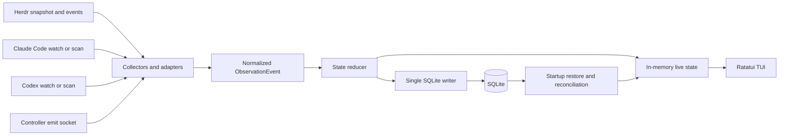

# Herdr Top MVP Design

## 1. Overview

Herdr Top is a Herdr-native terminal UI for observing Claude Code and Codex multi-agent execution in real time.

The tool runs inside a pane managed by the target Herdr session and observes that session's workspaces, tabs, panes, agent sessions, task runs, dependencies, and recent activity. It complements Herdr instead of replacing its session, terminal, workspace, or worktree management.

Repository: [mageyuki/herdr-top](https://github.com/mageyuki/herdr-top)

## 2. Decision summary

| Area | MVP decision |
| --- | --- |
| Product name | Herdr Top |
| Repository and binary | `herdr-top` |
| Runtime | A regular Herdr-managed pane or tab inside the target named session |
| Required platform | Herdr 0.8.0 or newer; initial development and test baseline: Herdr 0.8.0, socket protocol 19 |
| Agent providers | Claude Code and Codex |
| Superpowers | Not required and not used as a required data source |
| Primary view | Fixed-screen, htop-style live TUI |
| Hierarchy | Herdr physical topology plus Task Run and native sub-agent nesting |
| Physical pane identity | Herdr `terminal_id` is stable within one server run; public `pane_id` is the current address; no physical identity survives a cold restart |
| Cross-pane relationship | Independent and `unlinked` unless an explicit Controller relationship event links it |
| Dependency representation | A DAG separate from the execution tree |
| Data acquisition | Herdr snapshot/events, including reported native sessions, plus non-invasive Claude/Codex local metadata observation |
| Provider fallback | Two-second rescan when file watching is unavailable; no terminal-output scraping |
| Task Run identity | Explicit `task_run_id`, then native session reference with Herdr-reported identity preferred, then provisional `terminal_id + start time + collector sequence` |
| Controller protocol | Versioned JSON over a session-scoped Unix domain socket through `herdr-top emit` |
| Persistence | Session-scoped SQLite as the source of truth |
| State root | `${XDG_STATE_HOME:-$HOME/.local/state}/herdr-top/sessions/<session-key>`, keyed by the resolved session name; the collector socket lives in a runtime directory to respect socket-path length limits |
| Retention | Finished Task Runs 30 days; activity events ring-bounded at 100,000 per session and 7 days; `event_id` dedup ledger 7 days |
| Process model | One collector, reducer, SQLite writer, event socket, and TUI process per Herdr session |
| Second launch | Focus the existing Herdr Top pane instead of starting another collector |
| Quit | `q` stops Herdr Top only; Claude/Codex agents keep running |
| Restart behavior | Detach keeps the collector alive; cold server restart requires the next manual Herdr Top launch to restore and reconcile |
| Implementation language | Rust |
| Initial platforms | macOS arm64/x86_64 and Linux arm64/x86_64 |
| Distribution | Herdr managed GitHub plugin plus optional standalone CLI for Controller integration |
| License | MIT |

## 3. Goals

The MVP must:

- Run as a regular Herdr plugin pane or tab within the Herdr session being observed.
- Show current Claude Code and Codex activity across the same Herdr session.
- Make workspace, tab, pane, Task Run, and native sub-agent relationships understandable.
- Show cross-pane task relationships and dependencies only when explicitly recorded.
- Keep execution topology and task dependencies as separate views.
- Reflect watched Herdr or provider changes within one second at the 95th percentile under target load; fallback scanning adds at most one two-second polling interval.
- Show observation scope, freshness, source coverage, and degraded states in the fixed header.
- Restore persisted semantic state on the next Herdr Top launch after a cold Herdr server restart.
- Keep the display stable while information updates continuously.
- Work without Superpowers.
- Remain local-first and avoid sending session contents to an external service.
- Continue providing Herdr-only visibility when Claude or Codex metadata cannot be read.

## 4. Non-goals

The MVP does not:

- Replace Herdr as a multiplexer, session manager, worktree manager, or process owner.
- Orchestrate agents by itself.
- Infer semantic relationships from shared directories, neighboring panes, timestamps, prompts, or similar heuristics.
- Split one native agent session into multiple Task Runs by inspecting prompts or idle gaps.
- Treat token usage, context-window usage, or visible activity as task completion percentage.
- Scrape terminal output as a provider integration.
- Automatically restart the collector after a cold Herdr server restart.
- Run the long-lived monitor in a Herdr popup.
- Provide an unlimited long-term analytics or audit-history product.
- Support providers other than Claude Code and Codex.
- Support Windows in the initial release.
- Require a hosted observability service.
- Run multiple simultaneous TUI clients or perform automatic collector leader election.
- Install a standalone CLI into `PATH` without explicit user action.

## 5. Management units and terminology

### 5.1 Herdr physical units

Herdr owns the physical runtime hierarchy.

```text
Herdr named session
└── Workspace
    └── Tab
        └── Pane
            └── Foreground agent process
```

| Unit | Meaning in Herdr Top |
| --- | --- |
| Herdr named session | Runtime and socket namespace for a persistent Herdr server. Herdr Top observes one session at a time. |
| Workspace | Top-level Herdr project container. A repository or investigation usually maps to a workspace. |
| Project | Not a separate formal Herdr entity. The UI uses the workspace for project-like grouping. |
| Tab | A layout within a workspace. |
| Pane | A real terminal and the physical execution location of an agent or command. |
| `terminal_id` | Physical terminal identity, stable within a single Herdr server run. It follows a pane across moves, including cross-workspace moves, but Herdr does not persist it across a cold server restart. |
| Public `pane_id` | The pane's current Herdr address. It may change when a terminal moves between workspaces. |
| Native agent session | Claude Code or Codex's resumable session identity, distinct from a Herdr named session. |

References: [Herdr concepts](https://herdr.dev/docs/concepts/), [Herdr integrations](https://herdr.dev/docs/integrations/).

### 5.2 Herdr Top semantic units

| Unit | Meaning |
| --- | --- |
| Task Run | Herdr Top's semantic unit for one observed task. A Task Run may span multiple executions over time or concurrently, and a pane may host multiple Task Runs over time. |
| Agent Node | A Claude Code or Codex execution participating in a Task Run. |
| Native Sub-agent | A provider-native child session nested below its parent Task Run or Agent Node. |
| Execution Edge | An explicit parent-child relationship, such as a Controller dispatch. |
| Dependency Edge | An explicit directed relationship between Task Runs, such as `depends_on`. |
| Observation Event | A normalized event produced by a Herdr, Claude, Codex, or Controller adapter. |

A pane is an execution location, not a task identity.

### 5.3 Task Run identity and lifecycle

Identity is resolved in this order:

1. Explicit Controller `task_run_id`.
2. Provider plus native session reference — an ID, or a path pending resolution per section 5.4 — preferring Herdr's official-integration `agent_session` when available and using provider-local metadata as fallback.
3. Provisional `terminal_id + observed start time + collector sequence`.

Rules:

- Provisional identity is scoped to one collector run because `terminal_id` does not survive a cold server restart and physical executions are never continued across an observation gap.
- A different native session in the same pane creates a new Task Run.
- Resuming the same native session reactivates the existing Task Run.
- Moving the same terminal or native session does not create a new Task Run.
- A provisional Task Run merges into the resolved identity when the native session ID appears.
- Multiple prompts inside one native session are not automatically split.
- Finer semantic boundaries require explicit Controller events.
- Pane closure or process exit changes execution state, not semantic task completion.

### 5.4 Identity binding and merge rules

A Task Run is keyed by exactly one of, in priority order: K1 explicit Controller `task_run_id`; K2 provider plus native session reference; K3 provisional `terminal_id + observed start time + collector sequence`. Observed start time is the collector's wall-clock timestamp, at millisecond precision, of the first observation of the execution, and the collector sequence disambiguates same-millisecond observations; both are opaque key components, never ordering keys. K3 keys are scoped to one collector run and therefore never survive a server restart or a collector restart.

Native session references arrive as an ID or as a path. A Herdr `agent_session` of kind `id`, or provider-local metadata, yields the session ID directly. A reference of kind `path` is resolved to the session ID by the provider adapter when the file is readable; until then it is an opaque path-keyed reference and is never assumed equal to any ID. When a path resolves to an ID that no run owns, the run is re-keyed to that ID; when another run already owns the ID, the path-keyed run merges into it.

Merges happen only on explicit evidence, never by inference:

- K3 merges into K2 when the native session ID for that execution appears.
- K3 or K2 merges into K1 when a Controller event carries a native session ID or terminal identity that matches the run.
- Two K3 runs that resolve to the same native session merge into one run.

Every merge is preflighted by simulating the contracted graph: a merge that would create a self-edge, a dependency cycle, a dispatch cycle, or two differing dispatch parents is deferred and surfaced as a conflict in diagnostics rather than applied. When only one of the runs has a dispatch parent the merge carries it over, and identical parents deduplicate to one edge. On an applied merge the surviving Task Run keeps the highest-priority key; executions, Agent Nodes, events, and edges are repointed; the superseded key is retained as an alias, and events addressed to an alias resolve to the survivor before deduplication or placeholder creation.

A native session identity binds durably to at most one K1 run. Terminal identity is a point-in-time selector, not a durable reservation: a Controller binding by terminal identity matches the run whose execution is currently live on that terminal, and when none is live, the Controller run stays `unbound` with a diagnostic. A second K1 run claiming an already-bound native session is rejected as `conflict` and stays `unbound`. A Controller Task Run that carries no binding identity stays a separate semantic run and is surfaced as `unbound` in diagnostics and source coverage; it binds later only through an explicit event that carries binding identity.

A Task Run may span multiple executions, sequentially or concurrently — for example the same native session resumed in two panes. Task Run to execution is one-to-many; each execution keeps its own execution state and its own hosting pane while the task state stays single.

Provider-sourced events always attribute to the native-session-keyed Task Run or its merge target. Controller-declared sub-runs inside one native session are semantic children connected by execution edges; provider events are never attributed to them by inference.

## 6. Execution tree and task dependency DAG

The execution tree and the dependency graph answer different questions and must remain separate.

### 6.1 Execution tree

The execution tree answers: "Where is each execution running, and which native sub-agent belongs to it?"

```text
Session
├── Workspace: api
│   ├── Tab: implementation
│   │   ├── Pane w1:p1
│   │   │   └── Task Run: controller (Claude)
│   │   │       └── Claude native sub-agent: investigate
│   │   ├── Pane w1:p2
│   │   │   └── Task Run: implement (Codex)  [dispatched by: controller]
│   │   └── Pane w1:p3
│   │       └── Task Run: tests  [unlinked]
│   └── Tab: review
└── Workspace: docs
```

Native sub-agent nesting appears only beneath a Task Run of the same provider, because provider metadata is the only source of native parent-child edges and no provider's metadata can establish a cross-provider edge. A Controller `dispatch` links Task Runs across panes with an execution edge; the execution tree remains the physical tree and renders that edge as a `[dispatched by: …]` annotation on the child rather than re-parenting it. Each execution has one physical parent — the pane hosting it; the tree shows a Task Run under the pane of its most recent live execution, and a run with concurrent executions appears under each hosting pane with a shared-run marker. A Task Run has at most one semantic dispatch parent, so the execution view stays a tree because semantic parentage is annotation, not position. Grouping by dispatch parent belongs to the dependency view.

### 6.2 Task dependency DAG

The dependency view answers: "Which task must finish before another task can proceed?"

```text
investigate ──> implement ──> test ──> review
                    └───────> docs
```

Nesting must not be used to represent every dependency. A Task Run can depend on multiple other Task Runs, so dependencies form a DAG rather than a strict tree.

### 6.3 Unlinked rule

A task observed in another pane is displayed as an independent Task Run with `unlinked` relationship status unless an explicit event links it or the identity rules in section 5.4 establish it as another execution of an existing Task Run.

Herdr Top must not infer a Controller relationship from:

- the same workspace or tab;
- the same repository or current working directory;
- adjacent panes;
- similar start times;
- similar prompts or terminal output.

This rule favors an incomplete but truthful graph over a visually complete but incorrect graph.

## 7. Data sources

### 7.1 Herdr

Herdr is authoritative for:

- named-session connection;
- workspace, tab, and pane topology;
- `terminal_id` and current public `pane_id`;
- pane lifecycle and movement;
- detected agent kind and Herdr-reported execution state;
- official-integration `agent_session` identity for the pane's top-level native agent when available;
- active and focused pane metadata;
- plugin paths and invocation context.

The collector connects through `HERDR_SOCKET_PATH` and converges in a fixed order: subscribe to events first, buffer pushed events, fetch `session.snapshot` as the authoritative base, apply it, then replay the buffered events in receipt order, dispatching each by kind — creation events upsert their entity and closure events remove it. Anomaly classification happens at the buffer's drain boundary: an update for an entity absent from the snapshot, from the buffered creations, and from any later buffered closure marks the collector `RECONCILING` and triggers a resnapshot with a fresh buffer generation, bounded to three attempts before the collector stays `RECONCILING` and reports non-convergence rather than silently entering `LIVE`. Events arriving during replay append to the current generation's buffer, and the collector enters `LIVE` only after the buffer drains cleanly. Version fields are compared only where a pushed event actually carries one; most Herdr events carry none, so replay relies on idempotent upserts keyed by entity identity, not on version arithmetic. Herdr's event stream carries no global sequence number or replay cursor, so continuity can never be proven by the server. The collector therefore records an observation gap for any interval without an active subscription — initial startup, reconnects, and socket replacement included — and reconnect always repeats the subscribe-buffer-snapshot sequence. Gap reconciliation is uniform: every observation gap — startup, reconnect, socket replacement — retires every pre-gap execution and applies the attachment and closure rule of section 10.1 step 8 before buffered replay, while a resnapshot under an active subscription is not an observation gap and reconciles in place. Herdr's `seq` field on token-metadata reports orders that metadata only; it is not an event-stream cursor.

A valid Herdr-reported `agent_session` is the preferred source for the top-level native session identity. Its absence does not prevent physical monitoring; the Claude or Codex adapter can resolve the identity from provider-local metadata. Conflicting identities are not merged by inference; they follow the binding and merge rules in section 5.4 and are surfaced through diagnostics and source coverage.

References: [Herdr CLI reference](https://herdr.dev/docs/cli-reference/), [Herdr Socket API](https://herdr.dev/docs/socket-api/).

### 7.2 Claude Code and Codex adapters

Provider adapters use a non-invasive hybrid strategy:

1. Watch locally available native session metadata with filesystem notification and tail files incrementally: a per-file byte offset advances on append and only appended bytes are read, while an inode change or size regression signals rotation or truncation, resets the offset state, and reopens the file. Discovery performs one bounded bootstrap read per file — the first complete structural record, such as Codex's `session_meta`, parsed for allowlisted identity and topology fields only, with Claude topology derived from path structure alone — and historical activity is never replayed: ongoing tailing starts at the current end of file for files that predate the collector run, while files created or rotated during observation are read from byte zero. Incomplete trailing records buffer until their terminating newline.
2. Normalize provider, native session ID, model when available, recursive native sub-agent nesting, lifecycle signals, and allowlisted activity summaries.
3. Fall back to a two-second rescan when file notification is unavailable or unreliable; the rescan stats directories and files for mtime and size changes and tails only what changed — it never re-reads whole files, keeping the idle CPU budget of section 15 honest against hundreds of megabytes of local metadata.
4. Never scrape terminal output.

The common baseline is provider identity, native session identity, execution state, recent normalized activity, and native sub-agent nesting when exposed. Missing fields remain unavailable rather than fabricated.

Provider activity content is built from an explicit field allowlist and nothing else: provider, native session and agent identifiers, model ID, lifecycle and event kind, tool name without arguments, item and byte counts, and timestamps. The normalized identity, topology, relationship, and coverage fields of section 8.5 — workspace, tab, and pane IDs, `terminal_id`, Task Run and Agent Node IDs, edge endpoints, and source coverage — are always included, as are the identity references of section 5.4, including path-kind `agent_session` values, and the owner record of section 9.3. Operational paths — the session file an agent maps to, discovery diagnostics, log locations, and the section 10 breadcrumb — are persisted locally under the section 14 permissions and shown only in detail and `doctor` views, home-abbreviated and control-character-escaped. No value extracted from prompt text, response text, or tool arguments and results is persisted or displayed anywhere — including paths, URLs, and environment values found inside them; the same string remains legal when it arrives from an independent operational source. Controller-supplied `label` and `reason` strings are operator-provided display text, capped at 256 bytes, control-character-escaped, and truncated UTF-8-safely. Fixtures with sentinel strings prove the exclusions in section 15 by scanning the database, WAL, backups, logs — including malformed-record diagnostics — and rendered output. Malformed-record diagnostics are not activity content; their own allowlist is provider, the independently discovered, home-abbreviated, escaped source path, byte offset, and parser error code.

Agent Nodes form a recursive tree rather than a fixed one-level list, and deeper structures are tolerated wherever metadata establishes them — but observed reality is shallow: local evidence shows Codex nesting to depth two and Claude Code to depth one, and no depth field exists in either format. A native parent-child edge is created only when provider metadata establishes it. If an agent is observable but its immediate parent is not, it remains directly under the Task Run without an inferred Agent Node parent.

Claude Code hooks or OpenTelemetry may be added as optional higher-fidelity inputs. Core monitoring must not require Claude settings mutation, an OTLP exporter, or beta telemetry. Claude-local task or lifecycle events never create cross-pane Controller execution or dependency edges by themselves.

Provider formats are unstable external formats. Adapters accept optional and unknown fields, isolate parsing failures, and expose source coverage. If an adapter cannot read its source, the TUI remains usable in `DEGRADED / Herdr-only` mode.

The two discovery models are inverted and the adapters do not share a strategy. Claude Code stores each sub-agent in its own file under the parent session's `subagents/` directory, so topology is path-derived without content parsing; sub-agents are effectively always background, fan-out is high, spawn results can arrive long after the spawn or never, and named spawns vary the filename pattern. Codex stores every agent as an identically shaped rollout file whose first `session_meta` line carries `agent_path` and `parent_thread_id`; parents and children can sit in different date directories; `forked_from_id` marks forking rather than parenting and never creates an edge; and the parent's own rollout emits `sub_agent_activity` events — the preferred liveness signal, cheaper than opening every child file. Ephemeral side artifacts such as spawn output files are not data sources.

### 7.3 Explicit Controller events

A Controller or custom orchestrator can publish:

- `dispatch`;
- `task_started`;
- `depends_on`;
- `blocked`;
- `progress`;
- `complete`;
- `failed`;
- `cancelled`.

`dispatch` records an execution parent-child relationship. `depends_on` records a dependency DAG edge. Neither implies the other.

The collector owns the session-scoped Controller-socket responsibility at its resolved runtime-directory path (section 10) with current-user-only permissions. `herdr-top emit` sends one versioned JSON event and waits for `accepted`, `duplicate`, `rejected`, or `retryable`.

The minimum envelope contains:

- `schema_version = 1`;
- unique `event_id` and emission timestamp;
- source or Controller name and event type;
- Task Run ID;
- parent Task Run ID or dependency endpoints when applicable;
- optional label, progress, reason, provider, native session ID, and terminal identity.

The collector deduplicates by `event_id` against a ledger retained independently of activity-event pruning, and rejects dependency cycles. The protocol has no supersede or removal events: a mistaken edge or premature terminal state persists until retention expires, or indefinitely while referenced by active state per section 10.3, and correction events are deferred (section 18). If the collector is unavailable or the connection times out, `emit` warns but exits successfully by default so monitoring cannot stop orchestration; after transmission `emit` receives exactly one wire response — `accepted`, `duplicate`, `rejected`, or `retryable` — or reports `unresolved` when the connection fails or times out before any response; retrying the same `event_id` is safe within the ledger window and is the recovery path, and nothing is silently dropped. `--strict` returns non-zero for callers that require enforcement.

Envelope direction fields are explicit: `task_run_id` names the subject of the event; `depends_on_id` names the prerequisite the subject depends on; `parent_task_run_id` names the dispatch parent.

Every event admitted past the saturation check passes one pipeline in order: alias resolution; then `event_id` ledger lookup, where a hit returns `duplicate`; then validation against current reducer state with any placeholders staged, where a failure discards the staged placeholders and returns `rejected`; then the serialized writer-health gate, which returns `retryable` with `persistence_unavailable` while persistence is unhealthy; and otherwise ingest-sequence assignment, ledger insertion, application, enqueue to the single SQLite writer, and `accepted`. Alias resolution first means an event naming a merged-away key applies to the surviving run before deduplication and before any placeholder is created. Rejected events leave no trace beyond diagnostics: their `event_id` does not enter the deduplication set, so a corrected retry may reuse it.

Events referencing an unknown Task Run are forward references and are the normal case for a Controller announcing work before it starts. The unknown-endpoint rules cover every event: `dispatch` creates placeholders for an unknown subject and an unknown `parent_task_run_id`; `depends_on` creates placeholders for an unknown subject and an unknown `depends_on_id`; `task_started` on an unknown run creates it directly in `running`; `blocked` and `progress` on unknown runs create runs in `blocked` and `queued` respectively; `complete`, `failed`, and `cancelled` on unknown runs create them directly in that terminal state, flagged in diagnostics. Placeholders carry no execution. Relationship state follows the creating event: runs created by the relationship events `dispatch` and `depends_on` are `linked` because the creating edge is an explicit semantic relationship in the sense of section 8.3; runs created by task-state forward references start `unlinked` until an explicit edge links them — Controller ownership and relationship state are independent axes. Cycle rejection evaluates the dependency DAG including placeholders.

The reducer assigns every accepted event a global monotonic ingest sequence after successful validation and the writer-health gate, and transitions apply in ingest order. Envelope timestamps are display metadata, never ordering keys. Because a `rejected` response is issued only after reducer validation, rejection reasons that depend on reducer state are decidable at ack time. `accepted` means validated, deduplicated, sequenced, and enqueued to the single SQLite writer; durability follows within the writer's flush interval of at most one second, and a crash inside that window can drop an acknowledged event — the bound is stated so Controllers can reason about it. `duplicate` is reserved for a repeated `event_id`; a semantically identical event under a new `event_id` — including one that re-states an existing resolved edge — is an `accepted` no-op everywhere. `rejected` carries one reason: `invalid`, `cycle`, `conflict`, `stale_event`, or `unsupported_version`. A `schema_version` greater than 1 is rejected as `unsupported_version`. `retryable` carries reason `busy` or `persistence_unavailable` and is returned before ledger insertion and before reducer application, so retrying the same `event_id` is safe and is the expected recovery. Response precedence is fixed: admission saturation answers `retryable` with `busy` before the pipeline; `duplicate` follows alias resolution and ledger lookup; `rejected` follows validation; `retryable` with `persistence_unavailable` is decided at a serialized writer-health gate after validation and before sequencing, insertion, application, and enqueue; otherwise the event is `accepted`. A rejection and both retryable paths leave no ledger or reducer change and discard staged placeholders.

Controller task-state events are `task_started`, `blocked`, `progress`, `complete`, `failed`, and `cancelled`; `dispatch` and `depends_on` are relationship events and do not make a run Controller-owned. Task-state transitions are fixed. `task_started`: from `queued`, `blocked`, or `ended_unknown` to `running`; in `running` it is an `accepted` no-op; on another terminal state it is rejected as `stale_event`. `blocked`: from `queued`, `running`, or `ended_unknown` to `blocked`; in `blocked` it is an `accepted` no-op. `progress`: accepted in `queued`, `running`, or `blocked` without changing state; on `ended_unknown` it reactivates the run to `running`. `blocked` and `progress` on `completed`, `failed`, or `cancelled` are `accepted` no-ops that increment a diagnostic counter. `complete`, `failed`, `cancelled`: from any non-terminal state to the corresponding terminal state; any of the three refines `ended_unknown` because the Controller outcome is authoritative; the same terminal type on the same terminal state is an `accepted` no-op, and a different terminal type on `completed`, `failed`, or `cancelled` is rejected as `conflict`. `depends_on`: accepted until the subject is terminal, except that re-stating an existing resolved edge is an `accepted` no-op in any state; a cycle is rejected as `cycle`. `dispatch`: rejects self-parenting and any edge whose parent chain reaches the subject as `cycle`; otherwise accepted at any time; re-stating the same parent is an `accepted` no-op, and naming a different parent for a run that already has one is rejected as `conflict`.

Relationship-only placeholder runs — runs with no execution and no task-state event — never close automatically: edges never propagate terminality, and closing announced work without evidence would be inference. They stay `queued` until a task-state event or an execution bound under the section 5.4 rules arrives. A maximal weakly connected component of such runs across execution and dependency edges is a dangling announcement when it has no non-terminal outside neighbor, surfaced through a diagnostic counter. A run in `ended_unknown` that gains a new execution — the same native session resuming — reactivates to `running`.

Controller events are optional for read-only live monitoring but required for a complete cross-pane execution relationship or task DAG.

## 8. State model

Execution state, task state, relationship state, and observation quality are separate.

### 8.1 Execution state

- `unknown`
- `idle`
- `working`
- `blocked`
- `stale`
- `ended`

`stale` is temporary and applies only during uninterrupted live observation. An execution that disappears without an authoritative close remains stale for 30 seconds. If a fresh snapshot still cannot find it, execution becomes `ended`. Explicit pane close or process exit moves directly to `ended`. Reappearance of the same native session during the grace period restores its live state. The grace never applies across an observation gap — see section 10.1 step 8.

Herdr's five reported agent states map onto execution state as: `working` to `working`, `blocked` to `blocked`, `idle` to `idle`, `unknown` to `unknown`, and `done` to `idle` — Herdr documents `done` as the same underlying idle state after unseen background work finishes, so it never maps to `ended`. Herdr is authoritative for pane liveness and the execution state of the pane's top-level reported agent; provider metadata is the only lifecycle source for native child agents and otherwise adds identity, nesting, and activity detail, never overriding Herdr on pane liveness. Observation quality is evaluated per source, and the header shows the worst applicable state in severity order `DISCONNECTED`, then `RECONCILING`, then `DEGRADED`, then `LIVE`, with per-source detail in source coverage; the Controller input's availability appears in coverage only and never enters the worst-state aggregation, per section 10.

### 8.2 Task state

- `queued`
- `running`
- `blocked`
- `completed`
- `failed`
- `cancelled`
- `ended_unknown`

Activity, stale timeout, pane closure, and process exit do not mark a Task Run completed or infer a percentage. A Controller Task Run still marked `running` or `blocked` remains visible even with no live execution.

`ended_unknown` is the terminal state for closure with unknown outcome. It is entered automatically only by a Task Run that has never received a Controller task-state event, when its last execution reaches `ended`. It never claims success or failure — execution end still never implies semantic completion. A Task Run that has received any Controller task-state event never enters `ended_unknown` automatically; a Controller run still marked `running` or `blocked` remains visible with no live execution, as above. A later Controller terminal event refines `ended_unknown` into the reported outcome, any other Controller task-state event reactivates it, and a resumed execution reactivates the run, as defined in section 7.3.

### 8.3 Relationship state

- `unlinked`: no explicit Controller or dependency relationship is known;
- `linked`: at least one explicit semantic relationship identifies the Task Run.

Execution parent-child edges and dependency edges are stored separately.

### 8.4 Observation quality

- `LIVE`: subscribed and within the freshness target;
- `RECONCILING`: restoring, reconnecting, or resnapshotting;
- `DISCONNECTED`: Herdr socket unavailable;
- `DEGRADED`: physical state available but a provider source or performance target is unavailable.

### 8.5 Minimum normalized event fields

Each normalized observation contains:

- event ID, timestamp, source, and source event type;
- Herdr session namespace;
- workspace, tab, public pane ID, and terminal ID when applicable;
- provider and native session ID when applicable;
- Task Run and Agent Node IDs when known;
- normalized execution or task-state change;
- optional execution-parent or dependency endpoints;
- source coverage and minimal provider metadata.

## 9. Architecture



### 9.1 Components

| Component | Responsibility |
| --- | --- |
| Herdr collector | Event subscription, snapshot, buffered replay, reconnect, and bounded resnapshot. |
| Claude adapter | Watch or scan and normalize Claude session and sub-agent information. |
| Codex adapter | Watch or scan and normalize Codex session and sub-agent information. |
| Controller-event input | Validate and acknowledge semantic events over local IPC. |
| State reducer | Apply ordered events to execution and dependency models. |
| SQLite writer | Be the only component that mutates the database. |
| TUI | Render in-memory state and handle navigation. |
| Diagnostics | Report Herdr, lock, database, provider, version, and coverage health. |

### 9.2 Concurrency and rendering

Collectors send normalized events through bounded in-process channels with per-source overflow policies, and no class is dropped silently. When the Herdr channel would overflow, the collector marks the current buffer generation overflowed and enters `RECONCILING`, then runs section 7.1's bounded in-place resnapshot with a fresh generation under the still-active subscription — an in-process overflow discontinuity, not an observation gap, so no execution is retired; section 10.1 step 8 applies only to the observation gaps section 7.1 enumerates. Overflow and drain-boundary anomalies share a single convergence episode and one three-attempt counter — an overflow during recovery consumes the current attempt and never resets it. Provider activity coalesces per entity, keeping the newest state and counting coalesced updates in diagnostics. Controller events are validated at the serialized reducer as section 7.3 defines, so their backpressure is connection queueing bounded by the acceptor; saturation surfaces to `emit` as the `retryable` response with reason `busy` under the best-effort policy. Each queue's capacity is a fixed constant recorded in diagnostics. The reducer serializes transitions and sends persistence operations to one SQLite writer. The TUI renders in-memory state, not SQLite per frame. Rendering is event-driven and capped at 10 frames per second.

### 9.3 Session singleton

One owner process per Herdr named session owns the collector, reducer, writer, event socket, and TUI.

An OS advisory lock is scoped to the session key derived by the resolver in section 10, never from the socket path or launch cwd.

Startup:

1. Resolve the session key and attempt the advisory lock.
2. If acquired, validate or initialize the runtime sentinel per section 10 — initialize it on first launch, remove the socket only when the sentinel names this session and no live endpoint answers, treat a mismatched sentinel as a collision error, and surface a socket without a sentinel as an unsafe orphan without removing it — then open the database, reconcile, and become owner, entering the degraded Controller-input mode of section 10 when the socket path is unusable.
3. If held, read the owner record — PID, start time, `terminal_id`, and last known public pane ID, which the owner maintains in SQLite and refreshes on pane moves — resolve the owner's `terminal_id` to its current pane through a live snapshot, focus that pane, and exit without opening SQLite as writer.
4. If focus fails while the lock remains held, report owner information and do not start a second collector.

The acquiring owner replaces any stale owner record before subscribing. The OS releases the lock when the owner exits or crashes. A live but hung owner keeps it; the operator closes that pane before relaunching. Leases, fencing, leader election, and multiple clients are outside the MVP.

`q` stops Herdr Top's TUI, collector, socket, and writer only. It never stops Claude Code, Codex, or another pane. Direct CLI launch returns to its shell. Closing the owner pane has the same monitor-only effect. Herdr detach and reattach leave the process running.

## 10. Persistence and restart behavior

SQLite is the source of truth for recoverable Herdr Top state.

```text
${XDG_STATE_HOME:-$HOME/.local/state}/herdr-top/sessions/<session-key>/collector.lock
${XDG_STATE_HOME:-$HOME/.local/state}/herdr-top/sessions/<session-key>/herdr-top.sqlite3
${XDG_STATE_HOME:-$HOME/.local/state}/herdr-top/sessions/<session-key>/session-name.txt
<runtime-dir>/herdr-top/<hash16>.sock
<runtime-dir>/herdr-top/<hash16>.name
```

The path-safe `session-key` is derived from the Herdr named session name and from nothing else — never from the socket path, which can change across restarts and handoffs, and never from the launch cwd. Every launch context resolves the name through the same rule, in order: an explicit `--session <name>` flag; otherwise a non-empty `HERDR_SESSION` environment value; otherwise, inside a managed pane (`HERDR_ENV=1`), the reserved name `default`, matching the CLI convention that `default` names the unnamed session. Empty environment values count as unset, and the presence rule for `HERDR_SESSION` is observed behavior aligned with that CLI convention rather than a documented pane invariant, so `doctor` cross-checks the resolved key against the session socket layout as a consistency check — never as key derivation. `--socket <path>` overrides only the connection target and must be paired with `--session` in every context, because a snapshot does not reveal the session name. `emit` without a resolvable session name warns and exits 0 by default, or non-zero under `--strict`; an owner or TUI launch that cannot resolve a session name fails non-zero before touching any lock or state path, and `doctor` reports an unresolved session as a structured diagnostic. The session-key encoding rejects an empty name and names consisting only of dots, then forms `<sanitized>-<hash16>`: the name's UTF-8 bytes with ASCII letters lower-cased (no Unicode folding), every byte outside `[a-z0-9._-]` and any leading `.` replaced by `_`, truncated to 48 bytes, followed by the first 16 hex digits of the SHA-256 of the exact original name — so hostile names cannot traverse paths and accidental collisions, including case-only differences on case-insensitive filesystems, are avoided. The state directory records the exact original name in `session-name.txt`; a mismatch at startup refuses to open the directory, converting even a deliberate hash collision into a detected error. The Controller socket cannot live under the state root because home-directory paths overflow the platform socket-path length limit (108 bytes on Linux, 104 on macOS); it lives at `<runtime-dir>/herdr-top/<hash16>.sock`, where `<runtime-dir>` is `$XDG_RUNTIME_DIR` when set and otherwise `${TMPDIR:-/tmp}/herdr-top-<uid>`, `<hash16>` is the same 16 hex digits, and every component preflights the full socket path against the platform limit and fails with a clear error instead of binding a truncated path. Both runtime directory levels are created or opened without following symlinks; a pre-existing entry must be a real directory owned by the effective UID with mode exactly 0700, and anything else aborts without chmod or bind; the socket and its sentinel are created relative to the validated directory handle. Next to the socket lives a runtime sentinel `<hash16>.name` containing the exact session name. The sentinel is published atomically before the socket is bound: the name is written and synced to a private 0600 temp file with a fresh unique name per publication attempt — never a fixed path, so an abandoned temp from a crash neither blocks future publication nor races another publisher — then installed at `<hash16>.name` with no-replace semantics, so the final path never exposes empty or partial contents; when the final sentinel already exists the temp file is discarded and the existing sentinel must be a regular 0600 own-uid file before its contents are trusted — a malformed sentinel is an unsafe condition, a different name is a collision error, and the same name proceeds. A socket with no sentinel beside it is an unsafe orphan: it is surfaced as a diagnostic and never unlinked automatically. Orphan detection runs before sentinel publication, because publishing a sentinel next to an orphaned socket would retroactively legitimize it. On orderly shutdown an owner that successfully bound the Controller socket, while still holding the state lock, closes and unlinks only that bound socket; an unbound owner unlinks nothing; the sentinel is retained in both cases. Before any unlink or bind, a sentinel naming a different session is a collision error, never staleness; a socket is stale only when this session's state lock is held, the sentinel names this session, and no live endpoint answers. When the socket path is unusable — an unsafe orphan, a malformed sentinel, a collision, a live endpoint answering under this session's lock, or a bind failure — the owner still starts with the Controller-event input unavailable: a named diagnostic condition that leaves section 8.4 observation quality unchanged, appears in the header's source coverage, and carries a persistent diagnostic with `doctor` guidance. Neither the Controller socket nor the final sentinel is unlinked because of these conditions; private publication temps are discarded as specified above, and `emit` retains the best-effort failure policy of section 7.3. `emit` itself connects only after validating that the runtime sentinel names its resolved session; on a mismatch it delivers nothing, warns, and exits 0, or non-zero under `--strict`. A live endpoint that answers without being owned by the process holding this session's state lock — whether no process holds the lock or another process currently holds it — is reachable only through an implementation bug; possible `emit` delivery to it is an accepted residual risk surfaced by `doctor`, not a protocol concern. Owning the event socket, wherever this document states it — the section 2 process-model row, section 7.3, and section 9.3 — means owning the responsibility for it; a degraded, unbound Controller input is reported, never silently assumed away. `HERDR_PLUGIN_STATE_DIR` is available only to plugin-invoked processes and is path discovery only, so Herdr Top writes a single-line breadcrumb file `state-root.txt` there (mode 0600, rewritten at each plugin-context launch) pointing at the canonical state root for `doctor`; it is never the rendezvous path. Launches from different directories in the same named session share state; different named sessions do not.

Initial tables:

- `herdr_sessions`, `workspaces`, `tabs`, and `panes`;
- `native_agent_sessions`, `task_runs`, `executions`, and `agent_nodes`;
- `execution_edges` and `dependency_edges`;
- `display_ordinals`;
- `events`, `event_ledger`, `meta`, `owner`, and `schema_migrations`.

SQLite runs through bundled `rusqlite` with WAL enabled explicitly, `synchronous=FULL` so a flushed batch survives OS crashes and power loss, foreign keys on, and a busy timeout. The single writer batches work in transactions flushed at least once per second — the durability bound the Controller ack in section 7.3 states — and checkpoints the WAL periodically and at shutdown. While persistence is unhealthy the responder stops returning `accepted` and answers `retryable` with reason `persistence_unavailable`. A full disk or runtime write failure surfaces as a persistence diagnostic and degrades to in-memory monitoring, never silently; migration or backup failure stops startup, as section 14 states.

### 10.1 Startup reconciliation

After every successful owner launch:

1. Validate the runtime sentinel per section 10 and remove Herdr Top's own IPC socket only when that check proves it stale; a socket without a sentinel is never removed automatically.
2. Back up the database before schema migration using the SQLite online backup API — never a file copy, which can tear a live WAL.
3. Open and migrate the database.
4. Load persisted Task Runs, Agent Nodes, edges, and recent events.
5. Connect to the current Herdr named session.
6. Subscribe to Herdr events and buffer pushed events.
7. Fetch a fresh workspace, tab, pane, terminal, and agent snapshot.
8. Reconcile: physical executions never survive an observation gap. Every persisted execution is retired as `ended`, and fresh executions are constructed from the snapshot. Corroborated identity preserves the Task Run, not the execution record: a fresh execution attaches to an existing Task Run only when both sides carry equal, non-empty native session identities — the live side preferring Herdr's reported `agent_session` and falling back to the provider adapter's resolved identity. A disagreement between those two sources is not corroboration and is surfaced as a diagnostic, a kind-`path` reference that has not resolved to an ID never corroborates, and provisional runs from before the gap gain no new execution because they carry no identity to match. Retirement and attachment are evaluated together: automatic closure per section 8.2 applies only to runs left with no live execution after reconciliation. Semantic nodes reconcile only by the identity rules in sections 5.3 and 5.4.
9. Replay the buffered events idempotently, subscribe to provider changes, and enter the TUI.

A second invocation does not reconcile because it does not acquire the lock.

### 10.2 Runtime lifecycle

- Detach and reattach: owner keeps running.
- Cold Herdr restart: arbitrary monitor processes end; Herdr Top is not auto-started.
- Next manual launch: load SQLite, subscribe, fetch a fresh snapshot, and reconcile.
- Live Herdr handoff or socket replacement: enter `RECONCILING`, reconnect with the subscribe-buffer-snapshot sequence, record a collector-attested event gap for the disconnected interval, and apply section 10.1 step 8's retirement and attachment rule before replay; server-side continuity is never assumed.
- Provider source loss: retain Herdr topology in `DEGRADED / Herdr-only` mode.

Herdr restores its own topology and supported agent sessions. Herdr Top restores only its semantic model.

### 10.3 Retention and default visibility

- Active and non-terminal Task Runs are never time-hidden or auto-pruned.
- A `running` or `blocked` Task Run without live execution remains visible.
- Finished Task Runs and unreferenced edges are retained for 30 days.
- Events form an activity ring bounded to 100,000 per named session and 7 days; under the target sustained load the count bound dominates at roughly 83 minutes, which is intentional — semantic state never depends on event retention. The `event_id` deduplication ledger is stored separately and keeps IDs for the full 7 days regardless of ring eviction.
- Parents or dependencies referenced by active Task Runs are not pruned.
- Cleanup runs at startup, after ingestion, and on a collector-driven periodic tick.

The default TUI shows all non-terminal Task Runs plus runs that entered a terminal state — `completed`, `failed`, `cancelled`, or `ended_unknown` — during the last hour. Older retained runs remain filterable.

Prompts, responses, terminal scrollback, and raw provider payloads are not retained.

## 11. TUI behavior

The alternate-screen interface is fixed rather than append-only.

```text
┌ Herdr Top ─ host / session / workspaces / LIVE / lag / sources ┐
│ filters and summary counters                                   │
├ Execution tree or dependency view ─────────────────────────────┤
│ stable, selectable, internally scrollable viewport             │
├ Activity for selected item ────────────────────────────────────┤
│ recent normalized events                                       │
├ q stop monitor  tab view  / filter  f follow  ? help ──────────┤
```

Required behavior:

- fixed header and footer;
- header shows host, named session, workspace count, quality, event lag — the age of the oldest received but not yet applied event, zero when the queue is empty — and source coverage, truncating below the standard width in the fixed order of criterion 15;
- `LIVE`, `RECONCILING`, `DISCONNECTED`, and `DEGRADED` indicators;
- internal scrolling and lower selected-item activity;
- stable ordering and selection during updates: Task Runs receive a unique, persisted, immutable display ordinal on first entry into the model and siblings sort by it, never by an identity-key component; topology and agent rows use a stable in-session adoption order (full persisted-ordinal coverage for those rows is scheduled with the dependency-view and provider-adapter work); a state refresh never reorders rows, and after a merge the merged-in rows vanish while the survivor keeps its own ordinal and relative position;
- manual scroll disables follow; `f` or End resumes it;
- expand/collapse and filtering that retains matching ancestors — in the dependency view, every prerequisite path to a matching run;
- execution-tree and dependency-DAG toggle; the dependency view renders the conceptual DAG of section 6.2 as a stable topologically sorted list with prerequisite and dependent columns per run — prerequisites precede dependents, the display ordinal breaks topological ties, state refreshes preserve order, and only dependency-edge changes may reorder, minimally — so 1,000 edges stay scrollable and scannable;
- distinct `unlinked`, `blocked`, `stale`, `ended`, `ended_unknown`, and other terminal task states;
- selection moves to a surviving ancestor or neighbor when its node closes, and follows the surviving run through an identity merge, with the reason shown;
- `?` opens key help and setup guidance;
- minimum-size screen and safe truncation for narrow panes and wide Unicode;
- footer distinguishes `q` from Herdr detach.

Direct `herdr-top` uses the current pane and returns to its shell on `q`. The plugin entrypoint opens or focuses a dedicated regular tab or pane. It does not use a popup because popups have no Herdr pane identity.

On first TUI launch only, if a compatible standalone CLI is not discoverable in `PATH`, show a dismissible Controller-integration notice. Basic monitoring remains fully functional. `?` keeps the standalone CLI and `emit` setup instructions available.

## 12. Herdr plugin packaging

The repository includes `herdr-plugin.toml`.

```toml
id = "mageyuki.herdr-top"
name = "Herdr Top"
version = "0.1.0"
min_herdr_version = "0.8.0"
platforms = ["linux", "macos"]

[[build]]
command = ["scripts/fetch-release.sh"]

[[panes]]
id = "top"
title = "Herdr Top"
placement = "tab"
command = ["bin/herdr-top"]
```

The long-running TUI is a pane command, not a startup hook. The `[[build]]` command `scripts/fetch-release.sh` runs during `herdr plugin install`: it selects the release artifact for the current platform, verifies its checksum, and places the binary at `bin/herdr-top`, so installation needs no Rust toolchain.

### 12.1 Installation and update

General installation:

```sh
herdr plugin install mageyuki/herdr-top
```

Development:

```sh
cargo build --release
mkdir -p bin && cp target/release/herdr-top bin/herdr-top
herdr plugin link /absolute/path/to/herdr-top
```

`plugin link` does not run build commands.

For update, press `q` while agents continue, then run:

```sh
herdr plugin install mageyuki/herdr-top --yes
```

Reinstallation replaces the managed checkout. Databases live under the Herdr Top state root defined in section 10 and settings in the plugin config directory, so both survive reinstalls. Automatic update is deferred.

### 12.2 Release artifacts and Marketplace

Tagged releases provide checksum-verified binaries for macOS arm64/x86_64 and Linux arm64/x86_64. The manifest `[[build]]` command selects and verifies the matching artifact without requiring Rust.

After the first usable release, add the `herdr-plugin` GitHub topic for Marketplace discovery.

Herdr 0.8.0 has no supported post-install caveat field and does not show successful build output. The plugin does not write to `/dev/tty` or silently mutate `PATH`. Optional CLI setup is explained by the first-launch notice and `?`.

### 12.3 Optional standalone CLI and diagnostics

The managed plugin is sufficient for live monitoring. Controller-event users explicitly install the same release's standalone binary into `PATH`.

```sh
herdr-top --version
herdr-top emit ...
herdr-top doctor
herdr-top doctor --json
```

Herdr logs remain available through:

```sh
herdr plugin log list --plugin mageyuki.herdr-top
```

`doctor` checks Herdr socket, session key and its resolver source (flag, environment, or `default`), breadcrumb validity, the state-root `session-name.txt` record, the runtime sentinel, current Controller-socket availability and its reason, socket-path length, lock, database schema, provider discovery, Herdr official-integration versions, plugin/CLI compatibility, native-session coverage, and log locations without printing prompts or responses. Every executable, integration, or protocol version `doctor` reports is queried from the relevant binary or server — and reported as unavailable when that source cannot answer — never inferred from an installation path; self-updating installs make path-derived versions lie. For Herdr 0.8.0 native session restore, it expects Claude Code integration version 6 or newer and Codex integration version 5 or newer. Missing or older integrations do not block Herdr-only monitoring, but diagnostics explain the unavailable `agent_session` and restore coverage.

## 13. Technology stack

| Purpose | Rust crate |
| --- | --- |
| TUI | `ratatui` |
| Terminal backend | `crossterm` |
| Async socket, file, and event work | `tokio` |
| Filesystem notification | `notify` |
| SQLite | `rusqlite` with `bundled` and `backup` |
| Serialization | `serde`, `serde_json` |
| CLI and emit subcommand | `clap` |
| Structured logs | `tracing`, `tracing-subscriber` |
| Error types | `thiserror` |
| Internal IDs | `ulid` |

Initial development pins ratatui 0.30, crossterm 0.29, and rusqlite 0.40 with the `bundled` and `backup` features; the minimum supported Rust version follows ratatui 0.30's floor of 1.88. Exact versions live in `Cargo.lock`, and the design does not chase releases.

Rust is selected for single-binary distribution, predictable long-running resource use, terminal control, strong event and state types, and compatibility with the Herdr/Rust ecosystem.

Provider adapters must not force unstable Claude Code or Codex JSON into an overly rigid domain model. Unknown fields remain tolerated at the adapter boundary.

## 14. Privacy, safety, and failure handling

- Observation, IPC, and storage remain local by default.
- Store and display only fields on the section 7.2 allowlist — never prompts, responses, tool arguments or results, or terminal scrollback; operational paths appear only in detail and `doctor` views.
- Raw provider payload persistence is disabled.
- Parsers tolerate optional and unknown fields.
- Malformed provider events are logged and skipped without terminating the TUI; their diagnostics carry only the provider, the escaped allowlisted source path, a byte offset, and a parser error code — never raw bytes or decoded values.
- Provider loss yields `DEGRADED` with Herdr-only monitoring.
- Herdr socket loss yields `DISCONNECTED`, bounded reconnect, then the subscribe-buffer-snapshot sequence through `RECONCILING`.
- Reconnect continuity is never provable; every disconnected interval is recorded and shown as a collector-attested event gap.
- The state root, runtime socket directory, database, backups, and the runtime sentinel `<hash16>.name` are restricted to the current user: directories 0700, files 0600. The runtime socket directory is opened no-follow and re-validated (real directory, current-user-owned, exact mode) before use; the state root is created with these modes, while re-validation of a hostile pre-created state-root parent is scheduled with later hardening.
- Duplicate Controller events are acknowledged; cyclic dependencies are rejected.
- Best-effort `emit` failure warns but cannot terminate orchestration; `--strict` is opt-in.
- Migration backs up the database first. Failure stops startup and never resets the database automatically. An older binary refuses to open a database whose schema version is newer than it understands, with a clear upgrade message.
- Provisional nodes remain until the identity rules resolve, merge, or close them.
- Missing semantic links remain `unlinked`.
- The header shows hostname so identical remote session names are distinguishable.
- Panic handling restores the terminal where the platform permits.

## 15. Test strategy

### Unit tests

- sanitized real Claude and Codex fixtures — the evidenced Codex depth-two chain and Claude depth-one spawns — plus one synthetic Codex depth-three `agent_path` fixture marked format-plausible but unevidenced (Claude's observed layout cannot express deeper nesting, so no deeper Claude fixture is fabricated), unknown parents, unknown-field tolerance, and allowlist redaction proven with sentinel strings;
- Task Run identity priority and provisional merge;
- Herdr `agent_session` preference, provider-local fallback, and conflicting-identity handling;
- reducer transitions, live-observation stale grace versus observation-gap retirement, and `ended_unknown` closure;
- execution-edge versus dependency-edge separation;
- cycle rejection and event deduplication;
- tree and dependency-list ordering, display-ordinal stability across refreshes and merges, selection, and retention calculations;
- execution, task, relationship, and observation-quality separation;
- identity binding: path-to-ID promotion, single-K1 binding conflicts, merge preflight on contracted graphs including self-edges and cycles, and direct-dispatch cycle rejection;
- relationship-only placeholders staying `queued` and dangling-announcement diagnostics;
- `ended_unknown` refinement, reactivation by task-state events, and reactivation by resumed executions.

### Integration tests

- SQLite migration backup, recovery, and cleanup;
- one-writer ordering and startup reconciliation;
- pane create, close, move, and replacement by `terminal_id`;
- same-session resume and different-session pane reuse;
- provider file watch and two-second fallback scan;
- Controller wire responses including both `retryable` reasons, response precedence, their no-ledger and no-reducer effects, best-effort failure, and `--strict`;
- reconnect with the subscribe-buffer-snapshot sequence and collector-attested event-gap indication;
- second-launch focus and released-lock recovery;
- `q` proving agent processes remain untouched;
- session-key resolver fallback order, `--socket` pairing enforcement, hostile session names, maximum-length socket paths, socket-collision detection via the runtime sentinel, hostile runtime-directory states (symlink, wrong owner, wrong mode), and runtime-sentinel lifecycle (first launch, crash before sentinel publication restarting successfully with an abandoned temp present, crash between publication and bind, unsafe orphans, concurrent colliding-name creation, degraded Controller-input startup on unusable socket paths, `emit` refusing delivery on sentinel mismatch, and orderly shutdown and relaunch in both bound and degraded-unbound states);
- Task Run continuity with corroborated identity: physical executions replaced across the three observation-gap kinds — startup, reconnect, and socket replacement — and live resnapshot-in-place reconciling without replacement under the live-observation stale rule.

### TUI tests

- fixed layout and header scope/freshness/coverage;
- all four observation-quality states;
- scroll, collapse, follow, filtered ancestors, dependency-list order stability, and selection recovery;
- all non-terminal plus one-hour terminal default visibility;
- first-launch CLI notice and `?` help;
- narrow-terminal and wide-Unicode rendering.

### Performance tests

Target load:

- 50 live panes;
- 200 live or default-visible Task Runs;
- 1,000 dependency edges;
- 20 events per second sustained;
- 100 events per second burst for ten seconds without loss;
- screen update within one second at the 95th percentile;
- fallback scanning adding at most one two-second polling interval;
- input response within 100 milliseconds;
- startup within three seconds with 100,000 retained events;
- idle CPU target below 2 percent and memory target below 100 MB on the reference machine: a 4-core x86_64 Linux host with 16 GB RAM and a local SSD.

Above the target, enter `DEGRADED` and report lag. Older activity rendering may be omitted, but Task Runs and edges are not dropped.

### Plugin and release smoke tests

- manifest validation on Herdr 0.8.0;
- managed artifact download and checksum verification;
- local link after explicit build;
- regular pane/tab launch and second-launch focus;
- environment discovery and update while agents continue;
- Herdr official-integration version and native-session coverage diagnostics;
- standalone CLI protocol compatibility;
- clean terminal restoration after normal exit and panic.

## 16. Existing-tool comparison

| Tool | Useful capability | Gap addressed by Herdr Top |
| --- | --- | --- |
| Herdr built-in navigation | Physical workspace, tab, pane, and agent visibility | Does not represent the semantic Task Run DAG. |
| AgentHUD | Claude/Codex live session and native sub-agent observation | Does not reconstruct Herdr Controller relationships across panes. |
| `herdr-agent-dashboard` | Herdr agent status table | Flat view without semantic hierarchy or task dependencies. |
| `herdr-insight` | Herdr state history | Timeline rather than a Controller-aware execution model. |
| Huba | Claude-native task dependencies and progress | Claude-only and not a Herdr-native sidecar. |
| General observability platforms | Rich traces, metrics, and analytics | Require instrumentation or hosted infrastructure and do not expose Herdr topology natively. |

The capability and gap entries above reflect each tool's public description at design time and were not verified against installed copies.

Herdr Top's differentiating combination is:

- Herdr-native execution;
- Superpowers-independent operation;
- Claude Code and Codex support;
- htop-style real-time TUI;
- physical execution tree and semantic dependency DAG kept distinct;
- explicit, truthful cross-pane links;
- SQLite-backed restart recovery;
- no replacement of Herdr's existing session-management role.

## 17. MVP acceptance criteria

1. A regular managed pane or tab connects to its Herdr named session.
2. Live workspaces, tabs, panes, Claude/Codex executions, and available recursively nested native sub-agents are shown.
3. `terminal_id` preserves identity across pane moves while the server runs; after a cold restart, reconciliation relies on Task Run identity rules alone and never on stale physical identifiers.
4. Cross-pane runs remain `unlinked` without an explicit Controller relationship event; execution and dependency edges are the only linking evidence.
5. `dispatch` and `depends_on` create distinct persisted execution and dependency edges.
6. Duplicate events are idempotent and cycles are rejected.
7. Watched changes reach the screen within one second at the 95th percentile under target load; the fallback scan adds at most its two-second interval.
8. Provider failure leaves `DEGRADED / Herdr-only` visibility.
9. Non-authoritative disappearance during live observation is `stale` for 30 seconds before `ended`; across an observation gap executions retire immediately.
10. Execution end never implies semantic completion.
11. All non-terminal runs remain visible regardless of age.
12. Runs in a terminal state, including `ended_unknown`, remain default-visible for one hour and filterable for 30 days.
13. Activity events are ring-bounded to 100,000 per named session and seven days; the `event_id` ledger is retained independently for seven days; no semantic state depends on event retention.
14. The fixed TUI supports scroll, stable selection, activity, follow, help, and narrow panes.
15. At or above the standard width of 100 columns the header shows host, session, workspace count, quality, lag, and coverage; below it, down to the minimum supported width of 48 columns, fields truncate in the fixed order coverage, lag, workspace count, host — quality and session are never dropped.
16. `q` stops only Herdr Top; agents continue.
17. Detach/reattach keeps the collector running.
18. Cold restart stops the collector; next manual launch restores from SQLite and reconciles.
19. Live handoff reconnects with the subscribe-buffer-snapshot sequence, and the disconnected interval is recorded and shown as a collector-attested event gap.
20. Second launch focuses the owner and creates no second writer.
21. Launches from different directories in the same named session — including the unnamed `default` session — share state through the session-key rule; different named sessions remain isolated.
22. Completion and progress are never inferred from tokens, context, or activity.
23. Core monitoring works without Superpowers and without standalone CLI.
24. First launch explains optional CLI setup without modifying `PATH`.
25. `emit` is best-effort by default and supports `--strict`.
26. No prompt, response, or scrollback is persisted or transmitted.
27. macOS/Linux artifacts install through Herdr without Rust.
28. `doctor` reports health, Herdr integration versions, and native-session coverage without exposing content.
29. On the reference machine the target load meets every budget in section 15, and twice the target load sustained for 60 seconds degrades visibly without losing Task Runs or edges.

## 18. Deferred capabilities

- Windows support;
- web dashboard;
- remote aggregation across hosts or named sessions;
- hosted telemetry export;
- optional Claude Code hook and OpenTelemetry provider inputs;
- additional providers;
- long-term analytics and configurable retention;
- manual history purge and export;
- task controls such as cancel, retry, or redispatch;
- automatic orchestration;
- automatic plugin update or Marketplace publication automation;
- public stabilization of the Controller protocol;
- Controller correction events such as supersede and tombstone;
- multiple simultaneous TUI clients;
- background collector independent from TUI;
- automatic restart, leader election, lease expiry, and follower promotion;
- enterprise-scale operation around 1,000 concurrent agents.

## 19. Documentation policy

This document is the consolidated MVP design because it describes a complete product slice rather than one isolated architectural decision.

Use `docs/adr/` when recording an individual decision that has meaningful alternatives or when changing an accepted baseline. Likely future ADR topics include:

- Controller-event transport and compatibility policy;
- session identity and pane-move reconciliation;
- SQLite retention and migration policy;
- release binary and plugin installation strategy.

ADRs should reference this design rather than duplicate it.

## 20. Next-session starting point

The next development session should:

1. Read this design and current Herdr 0.8.0 plugin and Socket API documentation.
2. Verify the frozen contracts against a live Herdr with a throwaway probe: the subscribe-buffer-snapshot convergence, `terminal_id` behavior, and `agent_session` reporting; a mismatch between observed behavior and the frozen contracts stops the effort and reopens design review before planning.
3. Collect and sanitize real provider fixtures — the evidenced Codex depth-two chain and Claude depth-one spawns — marking synthetic deeper fixtures as unevidenced.
4. Produce a vertical-slice implementation plan.
5. Scaffold the Rust binary and module boundaries.
6. Implement the session-key resolver, runtime sentinel, advisory lock, SQLite migrations, online backup, and retention, with their tests.
7. Implement normalized identities, states, execution edges, dependency edges, and reducer tests, including the section 5.4 merge rules and the section 7.3 transition table.
8. Add a mocked Herdr collector and first fixed-screen tree.
9. Connect the real Herdr snapshot/event stream with the convergence algorithm and gap reconciliation.
10. Add Claude and Codex adapters with incremental tailing, the field allowlist, and the sanitized fixtures.
11. Add the Controller socket, versioned protocol, `emit`, and dependency view.
12. Add lifecycle, degraded-state, first-launch notice, doctor, and performance tests.
13. Add the manifest with its `[[build]]` artifact fetch, package release artifacts, and validate managed install on macOS and Linux.

The first vertical slice proves:

```text
Herdr subscribe/snapshot -> normalized state -> fixed-screen tree -> SQLite restore
```

before provider parsing or the complete dependency DAG.
