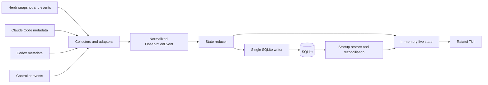

# Herdr Top MVP Design

## 1. Overview

Herdr Top is a Herdr-native terminal UI for observing Claude Code and Codex multi-agent execution in real time.

The tool runs inside a pane managed by the target Herdr session and observes that session's workspaces, tabs, panes, agent sessions, task runs, dependencies, and recent activity. It complements Herdr instead of replacing its session, terminal, workspace, or worktree management.

Repository: [mageyuki/herdr-top](https://github.com/mageyuki/herdr-top)

## 2. Decision summary

| Area | MVP decision |
| --- | --- |
| Product name | Herdr Top |
| Repository and binary | `herdr-top` |
| Runtime | A managed pane inside the target Herdr session |
| Required platform | Herdr |
| Agent providers | Claude Code and Codex |
| Superpowers | Not required and not used as a required data source |
| Primary view | Fixed-screen, htop-style live TUI |
| Hierarchy | Herdr physical topology plus Task Run and native sub-agent nesting |
| Cross-pane relationship | Independent and `unlinked` unless an explicit dependency event exists |
| Dependency representation | A DAG separate from the execution tree |
| Persistence | Session-scoped SQLite as the source of truth |
| Process model | One collector, SQLite writer, and TUI process per Herdr session |
| Second launch | Focus the existing Herdr Top pane instead of starting another collector |
| Restart behavior | After the owner process exits, the next launch acquires the session lock, restores persisted state, and reconciles with the live Herdr snapshot |
| Implementation language | Rust |
| Initial platforms | macOS and Linux |
| License | MIT |

## 3. Goals

The MVP must:

- Run as a Herdr plugin pane within the Herdr session being observed.
- Show current Claude Code and Codex activity across the same Herdr session.
- Make workspace, tab, pane, Task Run, and native sub-agent relationships understandable.
- Show cross-pane task dependencies only when they are explicitly recorded.
- Preserve the current execution model across a Herdr server restart and session restore.
- Keep the display stable while information updates continuously.
- Work without Superpowers.
- Remain local-first and avoid sending session contents to an external service.

## 4. Non-goals

The MVP does not:

- Replace Herdr as a multiplexer, session manager, worktree manager, or process owner.
- Orchestrate agents by itself.
- Infer semantic parent-child relationships from shared working directories, neighboring panes, timestamps, or similar heuristics.
- Treat token usage, context-window usage, or visible activity as task completion percentage.
- Provide an unlimited long-term analytics or audit-history product.
- Support providers other than Claude Code and Codex.
- Support Windows in the initial release.
- Require OpenTelemetry, LangSmith, Langfuse, or another hosted observability service.
- Run multiple simultaneous TUI clients or perform automatic collector leader election.

## 5. Management units and terminology

### 5.1 Herdr physical units

Herdr owns the physical runtime hierarchy.

```text
Herdr named session
└── Workspace
    └── Tab
        └── Pane
            └── Foreground agent process
```

| Unit | Meaning in Herdr Top |
| --- | --- |
| Herdr named session | Runtime and socket namespace for a persistent Herdr server. Herdr Top observes one session at a time. |
| Workspace | Top-level Herdr project container. A repository or investigation usually maps to a workspace. |
| Project | Not a separate formal Herdr entity. When the UI needs a project-like grouping, it uses the workspace. |
| Tab | A layout within a workspace. |
| Pane | A real terminal and the physical execution location of an agent or command. |
| Native agent session | Claude Code or Codex's own resumable session identity. It is distinct from a Herdr named session. |

References: [Herdr concepts](https://herdr.dev/docs/concepts/), [Herdr integrations](https://herdr.dev/docs/integrations/).

### 5.2 Herdr Top semantic units

| Unit | Meaning |
| --- | --- |
| Task Run | Herdr Top's semantic unit for one observed task execution. A pane may host multiple Task Runs over time. |
| Agent Node | A Claude Code or Codex execution participating in a Task Run. |
| Native Sub-agent | A provider-native child session that can be nested below its parent Task Run or Agent Node. |
| Dependency Edge | An explicit directed relationship between Task Runs, such as `depends_on`. |
| Observation Event | A normalized event produced by a Herdr, Claude, Codex, or Controller adapter. |

A pane is an execution location, not a task identity. Moving or reusing a pane must not silently merge distinct Task Runs.

## 6. Execution tree and task dependency DAG

The execution tree and the dependency graph answer different questions and must remain separate.

### 6.1 Execution tree

The execution tree answers: "Where is each execution running, and which native sub-agent belongs to it?"

```text
Session
├── Workspace: api
│   ├── Tab: implementation
│   │   ├── Pane w1:p1
│   │   │   └── Task Run: controller
│   │   │       ├── Claude sub-agent: investigate
│   │   │       └── Codex sub-agent: implement
│   │   └── Pane w1:p2
│   │       └── Task Run: tests [unlinked]
│   └── Tab: review
└── Workspace: docs
```

### 6.2 Task dependency DAG

The dependency view answers: "Which task must finish before another task can proceed?"

```text
investigate ──> implement ──> test ──> review
                    └───────> docs
```

Nesting must not be used to represent every dependency. A Task Run can depend on multiple other Task Runs, so dependencies form a DAG rather than a strict tree.

### 6.3 Unlinked rule

A task observed in another pane is displayed as an independent Task Run with `unlinked` relationship status unless an explicit event links it.

Herdr Top must not infer a Controller relationship from:

- the same workspace or tab;
- the same repository or current working directory;
- adjacent panes;
- similar start times;
- similar prompts or terminal output.

This rule favors an incomplete but truthful graph over a visually complete but incorrect graph.

## 7. Data sources

### 7.1 Herdr

Herdr is the authority for:

- named-session connection;
- workspace, tab, and pane topology;
- pane lifecycle and movement;
- detected agent kind;
- Herdr-reported agent execution state;
- active and focused pane metadata;
- plugin paths and invocation context.

The collector connects through `HERDR_SOCKET_PATH` and uses Herdr snapshot and event APIs. Herdr injects session and plugin environment variables into managed plugin panes.

References: [Herdr CLI reference](https://herdr.dev/docs/cli-reference/), [Herdr Socket API](https://herdr.dev/docs/socket-api/).

### 7.2 Claude Code and Codex adapters

Provider adapters read locally available native session identity and event metadata needed to show:

- provider;
- native session identifier;
- model when available;
- native sub-agent nesting when available;
- recent tool or activity summary;
- lifecycle signals not already authoritative in Herdr.

Provider session formats are treated as unstable external formats. Adapters must accept optional and unknown fields and retain raw values only when needed for debugging.

### 7.3 Explicit Controller events

A Controller or custom orchestrator can publish semantic events such as:

- `dispatch`;
- `task_started`;
- `depends_on`;
- `blocked`;
- `progress`;
- `complete`;
- `failed`;
- `cancelled`.

These events are optional for basic live observation but required for a complete cross-pane Controller tree or task DAG.

The MVP uses a local IPC input owned by the running collector. A thin `herdr-top emit` command may publish events, but it must not write SQLite directly. If the collector is unavailable, emission fails explicitly; the tool must not fall back to inferred relationships.

## 8. State model

Execution state and task state are stored separately.

### 8.1 Execution state

Execution state describes what the agent process appears to be doing now.

Initial normalized values:

- `unknown`
- `idle`
- `working`
- `blocked`
- `done`

### 8.2 Task state

Task state describes semantic task lifecycle and is authoritative only when supported by explicit events.

Initial values:

- `queued`
- `running`
- `blocked`
- `completed`
- `failed`
- `cancelled`

Live activity alone may update execution state, but it must not mark a Task Run completed or calculate a percentage.

### 8.3 Relationship state

Relationship state is independent from execution and task lifecycle.

Initial values:

- `unlinked`: no explicit Controller or dependency relationship is known;
- `linked`: at least one explicit semantic relationship identifies the Task Run.

A dependency edge is stored separately from this summary state and remains the authority for the DAG.

### 8.4 Minimum normalized event fields

Each normalized observation contains:

- event ID;
- timestamp;
- source and source event type;
- Herdr session namespace;
- workspace, tab, and pane identifiers when applicable;
- provider and native session identifier when applicable;
- Task Run identifier when known;
- parent Agent Node identifier when known;
- normalized execution or task-state change;
- optional dependency source and target;
- minimal provider-specific metadata.

## 9. Architecture



### 9.1 Components

| Component | Responsibility |
| --- | --- |
| Herdr collector | Obtain the initial topology and subscribe to lifecycle and agent-state changes. |
| Claude adapter | Normalize Claude Code session and native sub-agent information. |
| Codex adapter | Normalize Codex session and native sub-agent information. |
| Controller-event input | Accept explicit task and dependency events over local IPC. |
| State reducer | Apply ordered events to the in-memory execution and dependency models. |
| SQLite writer | Be the only process component that mutates the database. |
| TUI | Render current state and handle navigation without owning persistence logic. |

### 9.2 Concurrency rule

Collectors send normalized events through in-process channels. The reducer serializes state transitions and sends persistence operations to one SQLite writer.

The TUI renders in-memory state. It must not query SQLite on every frame.

### 9.3 Session singleton

The MVP runs exactly one Herdr Top owner process per Herdr session. That process owns the collector, reducer, SQLite writer, local Controller-event socket, and TUI.

The owner is selected with an OS advisory file lock scoped to a stable Herdr session key. The key is derived from the Herdr session/socket namespace, never from the launch working directory.

Startup behavior:

1. Resolve the current Herdr session key.
2. Attempt to acquire the session's advisory lock.
3. If the lock is acquired, remove any stale Herdr Top IPC socket, open the session database, and start as owner.
4. If the lock is already held, validate the recorded owner pane, ask Herdr to focus that pane, and exit successfully without opening SQLite as a writer.
5. If focusing fails while the lock remains held, report the existing owner information and exit without starting a second collector.

The operating system releases the advisory lock when the owner process exits or crashes. A later invocation can then acquire the lock and recover. A process that is alive but hung continues to own the lock; automatic lease expiry, forced takeover, fencing tokens, and leader election are outside the MVP. The operator must close or terminate the hung pane before restarting Herdr Top.

## 10. Persistence and restart behavior

SQLite is the source of truth for recoverable Herdr Top state. JSONL may be offered later for debugging or export, but it is not the primary database.

Session-scoped runtime and database locations:

```text
$HERDR_PLUGIN_STATE_DIR/sessions/<session-key>/collector.lock
$HERDR_PLUGIN_STATE_DIR/sessions/<session-key>/collector.sock
$HERDR_PLUGIN_STATE_DIR/sessions/<session-key>/herdr-top.sqlite3
```

`<session-key>` is a stable, path-safe identifier derived from the Herdr session/socket namespace. Different launch directories within the same default Herdr session resolve to the same key. Different named sessions resolve to different keys.

Initial logical tables:

- `herdr_sessions`
- `workspaces`
- `tabs`
- `panes`
- `native_agent_sessions`
- `task_runs`
- `agent_nodes`
- `dependency_edges`
- `events`
- `schema_migrations`

SQLite runs in WAL mode. Database access uses `rusqlite` with bundled SQLite to reduce dependence on the host's installed SQLite version.

### 10.1 Startup reconciliation

After acquiring the session lock on launch or restored plugin-pane start:

1. Remove only the stale IPC socket inside the acquired session directory.
2. Open and migrate the session database.
3. Load the persisted current-session Task Runs, Agent Nodes, edges, and recent events.
4. Connect to the Herdr socket for the current named session.
5. Fetch a fresh workspace, tab, pane, and agent snapshot.
6. Reconcile live physical nodes with persisted semantic nodes.
7. Mark persisted executions missing from the live snapshot as stale or ended rather than silently deleting them.
8. Subscribe to live events and enter the fixed-screen TUI.

If the lock is already held, this reconciliation path does not run. The second invocation focuses the existing owner pane and exits.

Herdr remains responsible for restoring workspaces, tabs, panes, layouts, processes, and supported native agent sessions. Herdr Top restores only its semantic model and reconciles it with Herdr's current state.

### 10.2 Scope and retention

The UI defaults to the currently connected Herdr named session. The MVP retains enough event data to restore that session's latest state but does not provide an unlimited history browser.

## 11. TUI behavior

The interface uses an alternate-screen, htop-style layout. Terminal rows do not continuously append.

```text
┌ Herdr Top ─ session / connection / event lag ───────────────┐
│ filters and summary counters                                │
├ Execution tree or dependency view ──────────────────────────┤
│ stable, selectable, internally scrollable viewport          │
│                                                             │
├ Activity for selected item ─────────────────────────────────┤
│ recent normalized events                                    │
├ q quit  tab view  / filter  f follow  enter details ────────┤
```

Required behavior:

- fixed header and footer;
- internal scrolling for the main tree;
- a lower activity panel for the selected item;
- stable ordering and selection while updates arrive;
- follow mode that can be enabled or disabled;
- tree nodes that can be expanded and collapsed;
- clear visual distinction between `unlinked`, `blocked`, stale, and completed items;
- a toggle between execution-tree and dependency views;
- resize-safe rendering for narrow panes.

## 12. Herdr plugin packaging

The implementation will include a `herdr-plugin.toml` manifest.

Initial stable identifiers:

```toml
id = "mageyuki.herdr-top"
name = "Herdr Top"

[[panes]]
id = "top"
title = "Herdr Top"
```

The long-running TUI is a plugin pane command. It must not use a one-shot startup hook as the monitoring loop.

Development installation:

```sh
herdr plugin link /absolute/path/to/herdr-top
```

The release process publishes tagged GitHub releases for macOS and Linux. The plugin manifest selects the matching binary or build command according to the supported Herdr plugin contract.

## 13. Technology stack

| Purpose | Rust crate |
| --- | --- |
| TUI | `ratatui` |
| Terminal backend | `crossterm` |
| Async socket, file, and event work | `tokio` |
| SQLite | `rusqlite` with `bundled` |
| Serialization | `serde`, `serde_json` |
| CLI and emit subcommand | `clap` |
| Structured logs | `tracing`, `tracing-subscriber` |
| Error types | `thiserror` |
| Internal IDs | `ulid` |

Rust is selected for single-binary distribution, predictable long-running resource use, terminal control, strong event and state types, and compatibility with the Herdr/Rust ecosystem.

Provider adapters must not force unstable Claude Code or Codex JSON into an overly rigid domain model. Unknown fields remain tolerated at the adapter boundary.

## 14. Privacy, safety, and failure handling

- All observation and storage remain local by default.
- Store normalized metadata rather than full prompts, responses, or terminal scrollback.
- Raw provider payload persistence is disabled by default.
- Malformed provider events are logged and skipped without terminating the TUI.
- A lost Herdr socket changes the UI to disconnected state and triggers bounded reconnect attempts.
- SQLite migration failure stops startup with a clear error and preserves the existing database.
- A cyclic dependency event is rejected because Task Run dependencies must remain a DAG.
- Unknown panes or native sessions may appear as provisional nodes until a later snapshot resolves them.
- Missing semantic links remain `unlinked`; the UI never fabricates a Controller edge.

## 15. Test strategy

### Unit tests

- Claude Code and Codex event parsing from sanitized fixtures;
- normalization and unknown-field tolerance;
- state-reducer transitions;
- dependency-cycle rejection;
- stable tree ordering and selection;
- status separation between execution and task state.

### Integration tests

- temporary SQLite database migrations and recovery;
- one-writer event ordering;
- startup reconciliation against a mocked Herdr snapshot;
- pane create, close, move, and agent-session replacement;
- Controller event input and dependency persistence;
- disconnection and reconnection.

### TUI tests

- fixed-layout rendering at representative terminal sizes;
- tree scrolling and collapse state;
- follow-mode behavior;
- narrow-terminal fallback;
- snapshots for execution and dependency views.

### Plugin smoke tests

- manifest validation;
- pane launch inside Herdr;
- injected environment-variable discovery;
- clean terminal restoration after normal exit and panic.

## 16. Existing-tool comparison

| Tool | Useful capability | Gap addressed by Herdr Top |
| --- | --- | --- |
| Herdr built-in navigation | Physical workspace, tab, pane, and agent visibility | Does not represent the semantic Task Run DAG. |
| AgentHUD | Claude/Codex live session and native sub-agent observation | Does not reconstruct Herdr Controller relationships across panes. |
| `herdr-agent-dashboard` | Herdr agent status table | Flat view without semantic hierarchy or task dependencies. |
| `herdr-insight` | Herdr state history | Timeline rather than a Controller-aware execution model. |
| Huba | Claude-native task dependencies and progress | Claude-only and not a Herdr-native sidecar. |
| General observability platforms | Rich traces, metrics, and analytics | Require instrumentation or hosted infrastructure and do not expose Herdr topology natively. |

Herdr Top's differentiating combination is:

- Herdr-native execution;
- Superpowers-independent operation;
- Claude Code and Codex support;
- htop-style real-time TUI;
- physical execution tree and semantic dependency DAG kept distinct;
- explicit, truthful cross-pane links;
- SQLite-backed restart recovery;
- no replacement of Herdr's existing session-management role.

## 17. MVP acceptance criteria

The MVP is acceptable when all of the following are true:

1. Running Herdr Top in a managed pane connects to that pane's Herdr named session.
2. It displays live workspaces, tabs, panes, and detected Claude Code or Codex executions from that session.
3. Native sub-agent nesting is displayed when provider metadata supplies it.
4. Cross-pane Task Runs appear independently as `unlinked` without explicit Controller events.
5. Explicit dependency events create persisted DAG edges and survive TUI restart.
6. A Herdr server restart followed by session restoration reloads the persisted semantic state and reconciles it with the new live snapshot.
7. The TUI uses a fixed screen with internal scrolling, stable selection, a lower activity panel, and follow toggle.
8. Task completion and progress are never inferred from token or context usage.
9. The core workflow works with Superpowers absent.
10. No observed prompt or response content is transmitted externally.
11. A second launch in the same Herdr session focuses the existing Herdr Top pane and does not create another collector or SQLite writer.
12. After the owner exits or crashes, the next launch acquires the released lock and restores the session state.
13. Launches from different working directories in the same default Herdr session use the same singleton and database, while different named sessions remain isolated.

## 18. Deferred capabilities

The following are intentionally deferred beyond the MVP:

- Windows support;
- a web dashboard;
- remote aggregation across multiple machines or Herdr named sessions;
- hosted telemetry export;
- additional agent providers;
- historical analytics and configurable retention;
- task-control actions such as cancel, retry, or redispatch;
- automatic orchestration;
- plugin marketplace publication automation;
- public stabilization of the Controller-event protocol;
- multiple simultaneous Herdr Top TUI clients;
- automatic collector restart, leader election, lease expiry, and follower promotion.

## 19. Documentation policy

This document is the consolidated MVP design because it describes a complete product slice rather than one isolated architectural decision.

Use `docs/adr/` when recording an individual decision that has meaningful alternatives or when changing an accepted baseline. Likely future ADR topics include:

- Controller-event transport and compatibility policy;
- session identity and pane-move reconciliation;
- SQLite retention and migration policy;
- release binary and plugin installation strategy.

ADRs should reference this design rather than duplicate it.

## 20. Next-session starting point

The next development session should:

1. Read this document and the current Herdr plugin and Socket API documentation.
2. Produce an implementation plan divided into vertical slices.
3. Scaffold the Rust binary and module boundaries.
4. Add `herdr-plugin.toml` with a minimal pane entrypoint.
5. Implement the normalized domain model and in-memory reducer first.
6. Implement the session-key derivation, advisory lock, session-scoped paths, SQLite migrations, and restart recovery.
7. Add a mocked Herdr collector and render the first fixed-screen tree.
8. Connect the real Herdr socket.
9. Add Claude Code and Codex adapters with sanitized fixtures.
10. Add Controller-event IPC and the dependency view after the live execution tree works.

The first vertical slice should prove:

```text
Herdr snapshot -> normalized state -> fixed-screen tree -> SQLite restore
```

before adding provider-specific parsing or a complete dependency DAG.
